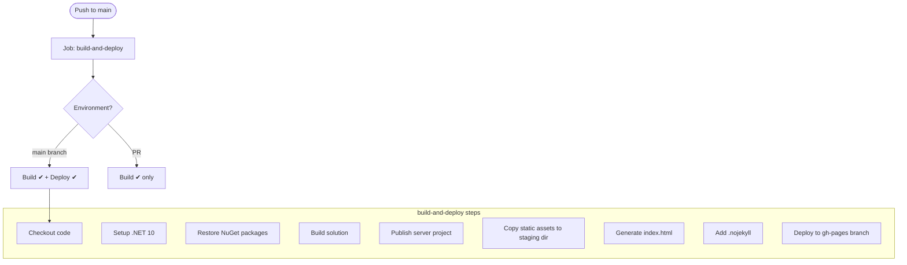
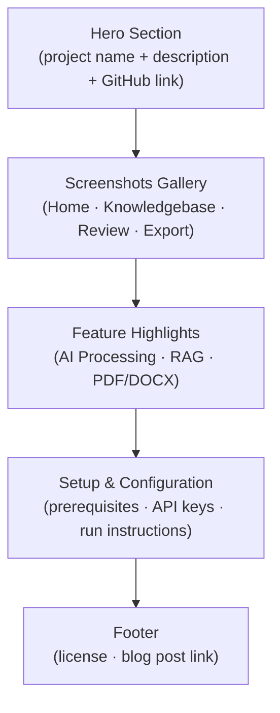
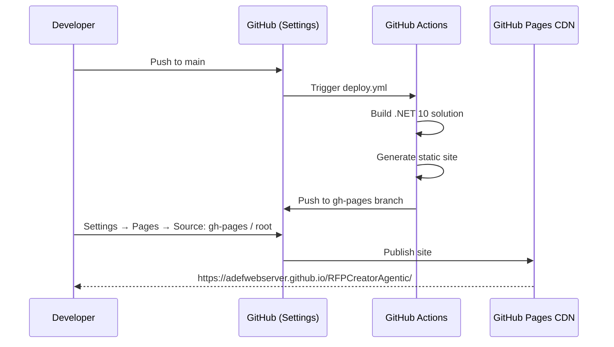

# GitHub Pages Deployment Plan

## Overview

This document describes the plan for automatically building the RFPCreatorAgentic project via GitHub Actions and deploying a project site to GitHub Pages. The deployed site provides project documentation, screenshots, and setup instructions for potential users and contributors.

> **Note:** RFPCreatorAgentic is a Blazor Web App (hybrid server + WebAssembly) that requires an ASP.NET Core server and Azure OpenAI API credentials at runtime. Because GitHub Pages only serves static files, the deployed site is a **documentation and demo showcase** rather than a live running application. The workflow also validates that the project builds successfully on every push to `main`.

---

## Table of Contents

1. [Architecture of the Deployment Pipeline](#architecture-of-the-deployment-pipeline)
2. [GitHub Actions Workflow Design](#github-actions-workflow-design)
3. [GitHub Pages Site Structure](#github-pages-site-structure)
4. [Base URL & Routing Considerations](#base-url--routing-considerations)
5. [Workflow Implementation Steps](#workflow-implementation-steps)
6. [Enabling GitHub Pages in the Repository](#enabling-github-pages-in-the-repository)
7. [README Badge & Link](#readme-badge--link)
8. [Security Considerations](#security-considerations)

---

## Architecture of the Deployment Pipeline

```mermaid
flowchart LR
    subgraph Developer["Developer Workflow"]
        commit["git push to main"]
    end

    subgraph GHA["GitHub Actions (ubuntu-latest)"]
        checkout["actions/checkout@v4"]
        dotnet["actions/setup-dotnet@v4\n.NET 10 preview"]
        restore["dotnet restore"]
        build["dotnet build --no-restore"]
        publish["dotnet publish\n(Release)"]
        genpage["Generate static\nindex.html"]
        nojekyll["Add .nojekyll"]
        deploy["JamesIves/github-pages-deploy-action@v4\n→ gh-pages branch"]
    end

    subgraph GHPages["GitHub Pages (gh-pages branch)"]
        site["https://adefwebserver.github.io\n/RFPCreatorAgentic/"]
    end

    commit --> checkout
    checkout --> dotnet
    dotnet --> restore
    restore --> build
    build --> publish
    publish --> genpage
    genpage --> nojekyll
    nojekyll --> deploy
    deploy --> site
```



---

## GitHub Actions Workflow Design

### Trigger

The workflow runs on every push to the `main` branch. Pull requests only run the **build** job (no deployment), allowing CI validation without affecting the live site.

### Jobs



### Key Workflow Properties

| Property | Value |
|---|---|
| Runner | `ubuntu-latest` |
| .NET version | `10.x` (preview quality) |
| Publish project | `BlazorWebApp/BlazorWebApp.csproj` |
| Publish configuration | `Release` |
| Deployment branch | `gh-pages` |
| Deployment action | `JamesIves/github-pages-deploy-action@v4` |

---

## GitHub Pages Site Structure

The `gh-pages` branch contains a self-contained static site. The structure after deployment is:

```
gh-pages/
├── index.html          ← Main landing page (project showcase)
├── .nojekyll           ← Disables GitHub's default Jekyll processing
├── assets/
│   ├── homepage.png    ← Screenshot copied from docs/
│   ├── processing.png
│   ├── review.png
│   └── export.png
└── docs/
    └── *.md            ← Implementation plan docs (optional deep-link content)
```

### Page Content Sections



---

## Base URL & Routing Considerations

GitHub Pages serves the project at a sub-path:

```
https://adefwebserver.github.io/RFPCreatorAgentic/
```

Because this deployment is a **static documentation page** (not the running Blazor app), standard Blazor base-href rewriting is not required. The generated `index.html` uses relative asset paths.

If a future iteration deploys the standalone WASM client to GitHub Pages, the following steps would be required:

1. Change `<base href="/" />` in `App.razor` to `<base href="/RFPCreatorAgentic/" />` at publish time (using `sed` in the workflow).
2. Use `blazor.webassembly.js` instead of `blazor.web.js` for static bootstrapping.
3. Add a `404.html` redirect to enable SPA-style deep linking:

```html
<!-- 404.html -->
<!DOCTYPE html>
<html>
  <head>
    <meta charset="utf-8">
    <script>
      var pathSegmentsToKeep = 1;
      var l = window.location;
      l.replace(
        l.protocol + '//' + l.hostname + (l.port ? ':' + l.port : '') +
        l.pathname.split('/').slice(0, 1 + pathSegmentsToKeep).join('/') + '/?/' +
        l.pathname.slice(1).split('/').slice(pathSegmentsToKeep).join('/').replace(/&/g, '~and~') +
        (l.search ? '&' + l.search.slice(1).replace(/&/g, '~and~') : '') +
        l.hash
      );
    </script>
  </head>
  <body></body>
</html>
```

---

## Workflow Implementation Steps

Below is the full workflow file to be saved at `.github/workflows/deploy.yml`:

```yaml
name: Build and Deploy to GitHub Pages

on:
  push:
    branches:
      - main
  pull_request:
    branches:
      - main

permissions:
  contents: write

jobs:
  build-and-deploy:
    runs-on: ubuntu-latest

    steps:
      - name: Checkout repository
        uses: actions/checkout@v4

      - name: Setup .NET 10
        uses: actions/setup-dotnet@v4
        with:
          dotnet-version: '10.x'
          dotnet-quality: 'preview'

      - name: Restore dependencies
        run: dotnet restore BlazorWebApp.sln

      - name: Build solution
        run: dotnet build BlazorWebApp.sln --no-restore --configuration Release

      - name: Publish server project
        run: dotnet publish BlazorWebApp/BlazorWebApp.csproj --no-restore --configuration Release --output ./publish

      - name: Prepare GitHub Pages staging directory
        run: |
          mkdir -p ./gh-pages-staging/assets

          # Copy screenshot images from docs/
          cp docs/HomePage.png       ./gh-pages-staging/assets/homepage.png   2>/dev/null || true
          cp docs/Processing.png     ./gh-pages-staging/assets/processing.png 2>/dev/null || true
          cp docs/ReviewAndEditRFPAnswers.png ./gh-pages-staging/assets/review.png 2>/dev/null || true
          cp docs/ExportProposal.png ./gh-pages-staging/assets/export.png     2>/dev/null || true

      - name: Generate index.html
        run: |
          cat > ./gh-pages-staging/index.html << 'EOF'
          <!DOCTYPE html>
          <html lang="en">
          <head>
            <meta charset="utf-8" />
            <meta name="viewport" content="width=device-width, initial-scale=1.0" />
            <title>RFP Creator Agentic</title>
            <style>
              /* styles inlined for zero external dependencies */
              *, *::before, *::after { box-sizing: border-box; margin: 0; padding: 0; }
              body { font-family: system-ui, sans-serif; color: #1a1a2e; background: #f8f9fa; }
              header { background: linear-gradient(135deg, #1a1a2e 0%, #16213e 100%); color: #fff; padding: 3rem 2rem; text-align: center; }
              header h1 { font-size: 2.5rem; margin-bottom: .5rem; }
              header p  { font-size: 1.1rem; opacity: .85; max-width: 600px; margin: .75rem auto 0; }
              .btn { display: inline-block; margin-top: 1.5rem; padding: .75rem 2rem; background: #0f3460; color: #fff; border-radius: 6px; text-decoration: none; font-weight: 600; }
              .btn:hover { background: #e94560; }
              section { max-width: 960px; margin: 3rem auto; padding: 0 1.5rem; }
              h2 { font-size: 1.6rem; margin-bottom: 1rem; color: #0f3460; border-bottom: 2px solid #e94560; padding-bottom: .4rem; }
              .screenshots { display: grid; grid-template-columns: repeat(auto-fit, minmax(280px, 1fr)); gap: 1.25rem; margin-top: 1rem; }
              .screenshots figure { background: #fff; border-radius: 8px; overflow: hidden; box-shadow: 0 2px 12px rgba(0,0,0,.1); }
              .screenshots img { width: 100%; display: block; }
              .screenshots figcaption { padding: .6rem 1rem; font-size: .875rem; color: #555; }
              .features { display: grid; grid-template-columns: repeat(auto-fit, minmax(200px, 1fr)); gap: 1rem; margin-top: 1rem; }
              .feature { background: #fff; border-left: 4px solid #e94560; padding: 1rem 1.25rem; border-radius: 0 8px 8px 0; box-shadow: 0 1px 6px rgba(0,0,0,.07); }
              .feature h3 { font-size: 1rem; margin-bottom: .4rem; color: #0f3460; }
              pre { background: #1a1a2e; color: #e2e8f0; padding: 1.25rem; border-radius: 8px; overflow-x: auto; font-size: .875rem; line-height: 1.6; }
              footer { text-align: center; padding: 2rem; color: #666; font-size: .875rem; margin-top: 4rem; border-top: 1px solid #dee2e6; }
              footer a { color: #0f3460; text-decoration: none; }
            </style>
          </head>
          <body>
            <header>
              <h1>🤖 RFP Creator Agentic</h1>
              <p>An AI-powered RFP Responder that lets you upload PDFs, build a knowledge base, and generate professional proposal responses using Azure OpenAI.</p>
              <a class="btn" href="https://github.com/ADefWebserver/RFPCreatorAgentic">View on GitHub</a>
            </header>

            <section>
              <h2>Screenshots</h2>
              <div class="screenshots">
                <figure>
                  
                  <figcaption>Home — Upload RFP and start processing</figcaption>
                </figure>
                <figure>
                  
                  <figcaption>Processing — AI extracts and answers RFP questions</figcaption>
                </figure>
                <figure>
                  
                  <figcaption>Review — Edit and refine AI-generated answers</figcaption>
                </figure>
                <figure>
                  
                  <figcaption>Export — Download the completed Word document</figcaption>
                </figure>
              </div>
            </section>

            <section>
              <h2>Key Features</h2>
              <div class="features">
                <div class="feature"><h3>📄 PDF Knowledgebase</h3><p>Upload PDFs to build a searchable knowledge base used to answer RFP questions.</p></div>
                <div class="feature"><h3>🧠 RAG Pipeline</h3><p>Retrieval-Augmented Generation finds the most relevant context before generating answers.</p></div>
                <div class="feature"><h3>✏️ Editable Answers</h3><p>Review and edit every AI-generated answer before exporting the final document.</p></div>
                <div class="feature"><h3>📝 Word Export</h3><p>Generate a professional .docx proposal document with a single click.</p></div>
                <div class="feature"><h3>🔑 BYO API Keys</h3><p>Connect your own Azure OpenAI or OpenAI-compatible endpoint — nothing stored server-side.</p></div>
                <div class="feature"><h3>🌐 Blazor WebAssembly</h3><p>Core AI processing runs in the browser; no data leaves your machine unless you configure an endpoint.</p></div>
              </div>
            </section>

            <section>
              <h2>Quick Start</h2>
              <pre><code># Prerequisites: .NET 10 SDK + Azure OpenAI resource

git clone https://github.com/ADefWebserver/RFPCreatorAgentic.git
cd RFPCreatorAgentic
dotnet run --project BlazorWebApp/BlazorWebApp.csproj</code></pre>
              <p style="margin-top:1rem">Then open <strong>Settings</strong> in the app and enter your Azure OpenAI endpoint and API key.</p>
            </section>

            <section>
              <h2>Documentation</h2>
              <ul style="line-height:2">
                <li><a href="https://github.com/ADefWebserver/RFPCreatorAgentic/blob/main/docs/RFP-Responder-Implementation-Plan.md">Implementation Plan</a></li>
                <li><a href="https://github.com/ADefWebserver/RFPCreatorAgentic/blob/main/docs/Phase1-Foundation.md">Phase 1 – Foundation</a></li>
                <li><a href="https://github.com/ADefWebserver/RFPCreatorAgentic/blob/main/docs/Phase2-AI-Integration.md">Phase 2 – AI Integration</a></li>
                <li><a href="https://github.com/ADefWebserver/RFPCreatorAgentic/blob/main/docs/Phase3-Knowledgebase.md">Phase 3 – Knowledgebase</a></li>
                <li><a href="https://github.com/ADefWebserver/RFPCreatorAgentic/blob/main/docs/Phase4-RFP-Processing.md">Phase 4 – RFP Processing</a></li>
                <li><a href="https://github.com/ADefWebserver/RFPCreatorAgentic/blob/main/docs/Phase5-Document-Generation.md">Phase 5 – Document Generation</a></li>
                <li><a href="https://github.com/ADefWebserver/RFPCreatorAgentic/blob/main/docs/Phase6-Polish.md">Phase 6 – Polish</a></li>
                <li><a href="https://github.com/ADefWebserver/RFPCreatorAgentic/blob/main/docs/GitHub-Pages-Deployment-Plan.md">GitHub Pages Deployment Plan</a></li>
              </ul>
            </section>

            <footer>
              <p>
                Licensed under <a href="https://github.com/ADefWebserver/RFPCreatorAgentic/blob/main/LICENSE.txt">the project license</a> ·
                Read the <a href="https://blazorhelpwebsite.com/ViewBlogPost/20084">blog post</a> ·
                <a href="https://github.com/ADefWebserver/RFPCreatorAgentic">GitHub repository</a>
              </p>
            </footer>
          </body>
          </html>
          EOF

      - name: Add .nojekyll
        run: touch ./gh-pages-staging/.nojekyll

      - name: Deploy to GitHub Pages
        if: github.ref == 'refs/heads/main' && github.event_name == 'push'
        uses: JamesIves/github-pages-deploy-action@v4
        with:
          branch: gh-pages
          folder: gh-pages-staging
```

---

## Enabling GitHub Pages in the Repository

After the first successful workflow run (which creates the `gh-pages` branch), enable GitHub Pages in the repository settings:



**Step-by-step (one-time, after first workflow run):**

1. Navigate to the repository on GitHub.
2. Click **Settings** → **Pages** (in the left sidebar).
3. Under **Source**, select **Deploy from a branch**.
4. Choose branch: **`gh-pages`**, folder: **`/ (root)`**.
5. Click **Save**.
6. The site will be available at `https://adefwebserver.github.io/RFPCreatorAgentic/` within a few minutes.

---

## README Badge & Link

Add the following to the top of `README.md` so the GitHub Pages link is immediately visible to visitors:

```markdown
[](https://adefwebserver.github.io/RFPCreatorAgentic/)
```

---

## Security Considerations

| Risk | Mitigation |
|---|---|
| Secrets in workflow logs | No API keys or secrets are used during the build/deploy process |
| Dependency supply-chain | Workflow actions are pinned to a major version (`@v4`) |
| Write permissions | `permissions: contents: write` is scoped to the workflow level only |
| GitHub Pages access | The site is public by default; no sensitive data is published |
| NuGet packages | `dotnet restore` fetches packages only from official NuGet.org feeds |
