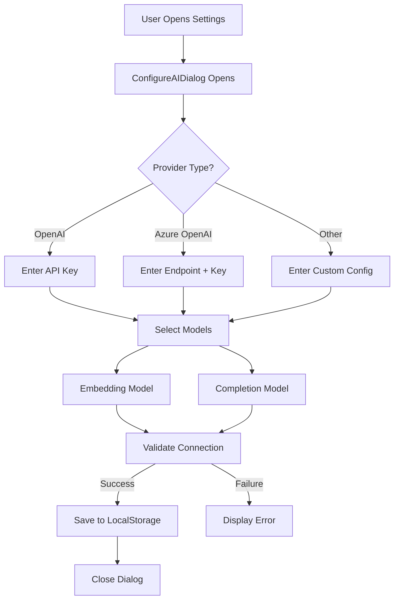
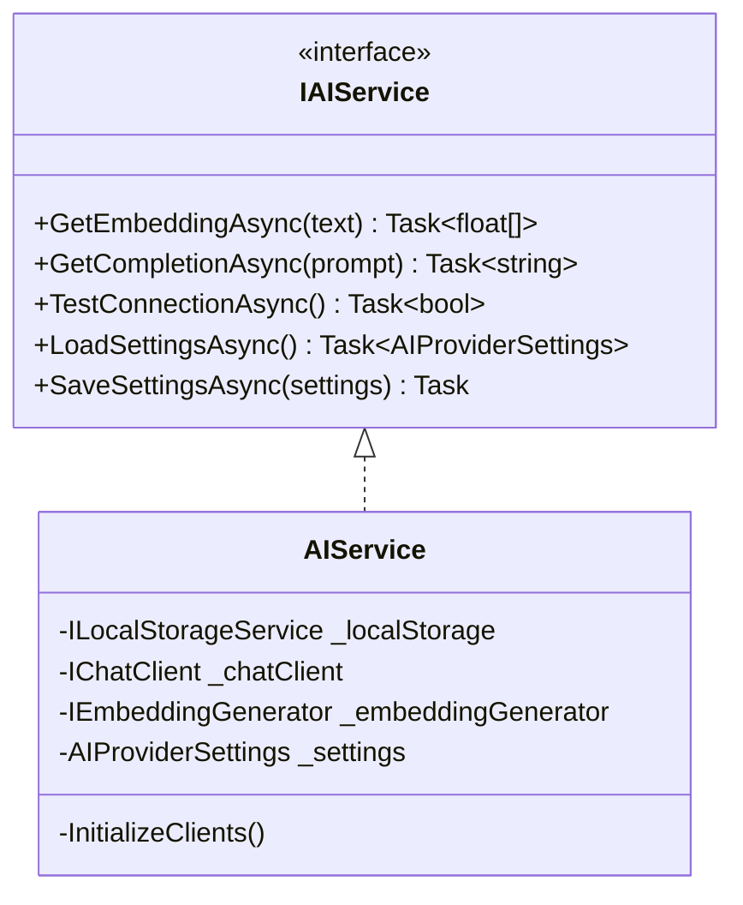

# Phase 2: AI Integration

## Overview

Implement AI provider configuration, settings persistence, and core AI services for embedding and completion operations.

---

## Checklist

- [ ] Create AI provider settings model
- [ ] Implement ConfigureAIDialog
- [ ] Create AIService with Microsoft.Extensions.AI.OpenAI
- [ ] Implement embedding generation
- [ ] Implement chat completion

---

## Configuration Dialog Flow



---

## Data Models

### AIProviderSettings

```csharp
// Models/AIProviderSettings.cs
public class AIProviderSettings
{
    public string Id { get; set; } = Guid.NewGuid().ToString();
    public string ProviderType { get; set; } = "OpenAI";  // "OpenAI", "AzureOpenAI", etc.
    public string DisplayName { get; set; }
    public string ApiKey { get; set; }
    public string Endpoint { get; set; }
    public string EmbeddingModel { get; set; } = "text-embedding-ada-002";
    public string CompletionModel { get; set; } = "gpt-4";
    public bool IsActive { get; set; }
    public DateTime CreatedAt { get; set; } = DateTime.UtcNow;
    public DateTime LastUpdated { get; set; } = DateTime.UtcNow;
}
```

---

## Implementation Details

### 1. Create AIService Interface

```csharp
public interface IAIService
{
    Task<float[]> GetEmbeddingAsync(string text);
    Task<string> GetCompletionAsync(string prompt);
    Task<bool> TestConnectionAsync();
    Task<AIProviderSettings> LoadSettingsAsync();
    Task SaveSettingsAsync(AIProviderSettings settings);
}
```

### 2. Implement AIService

```csharp
public class AIService : IAIService
{
    private readonly ILocalStorageService _localStorage;
    private IChatClient _chatClient;
    private IEmbeddingGenerator<string, Embedding<float>> _embeddingGenerator;
    private AIProviderSettings _settings;
    
    private const string SettingsKey = "ai_provider_settings";
    
    public AIService(ILocalStorageService localStorage)
    {
        _localStorage = localStorage;
    }
    
    public async Task<AIProviderSettings> LoadSettingsAsync()
    {
        _settings = await _localStorage.GetItemAsync<AIProviderSettings>(SettingsKey);
        if (_settings != null)
        {
            InitializeClients();
        }
        return _settings;
    }
    
    public async Task SaveSettingsAsync(AIProviderSettings settings)
    {
        settings.LastUpdated = DateTime.UtcNow;
        await _localStorage.SetItemAsync(SettingsKey, settings);
        _settings = settings;
        InitializeClients();
    }
    
    private void InitializeClients()
    {
        if (_settings == null) return;
        
        var client = _settings.ProviderType switch
        {
            "OpenAI" => new OpenAIClient(_settings.ApiKey),
            "AzureOpenAI" => new AzureOpenAIClient(
                new Uri(_settings.Endpoint), 
                new ApiKeyCredential(_settings.ApiKey)),
            _ => throw new NotSupportedException($"Provider {_settings.ProviderType} not supported")
        };
        
        _chatClient = client.AsChatClient(_settings.CompletionModel);
        _embeddingGenerator = client.AsEmbeddingGenerator(_settings.EmbeddingModel);
    }
    
    public async Task<float[]> GetEmbeddingAsync(string text)
    {
        if (_embeddingGenerator == null)
            throw new InvalidOperationException("AI service not configured");
        
        var result = await _embeddingGenerator.GenerateEmbeddingAsync(text);
        return result.Vector.ToArray();
    }
    
    public async Task<string> GetCompletionAsync(string prompt)
    {
        if (_chatClient == null)
            throw new InvalidOperationException("AI service not configured");
        
        var response = await _chatClient.GetCompletionAsync(prompt);
        return response.Message.Text;
    }
    
    public async Task<bool> TestConnectionAsync()
    {
        try
        {
            var testEmbed = await GetEmbeddingAsync("test connection");
            return testEmbed != null && testEmbed.Length > 0;
        }
        catch
        {
            return false;
        }
    }
}
```

### 3. Implement ConfigureAIDialog

```razor
@* ConfigureAIDialog.razor *@
@using Radzen
@using Radzen.Blazor
@inject IAIService AIService
@inject DialogService DialogService
@inject NotificationService NotificationService

<RadzenTemplateForm TItem="AIProviderSettings" Data="@settings" Submit="OnSubmit">
    <RadzenStack Gap="1rem">
        <RadzenFormField Text="Provider Type">
            <RadzenDropDown 
                @bind-Value="settings.ProviderType"
                Data="@providerTypes"
                Style="width: 100%;" 
                Change="OnProviderTypeChanged" />
        </RadzenFormField>
        
        <RadzenFormField Text="API Key">
            <RadzenPassword 
                @bind-Value="settings.ApiKey"
                Style="width: 100%;" 
                Placeholder="Enter your API key" />
        </RadzenFormField>
        
        <RadzenFormField Text="Endpoint" Visible="@(settings.ProviderType == "AzureOpenAI")">
            <RadzenTextBox 
                @bind-Value="settings.Endpoint"
                Style="width: 100%;" 
                Placeholder="https://your-resource.openai.azure.com/" />
        </RadzenFormField>
        
        <RadzenFormField Text="Embedding Model">
            <RadzenDropDown 
                @bind-Value="settings.EmbeddingModel"
                Data="@embeddingModels"
                Style="width: 100%;" />
        </RadzenFormField>
        
        <RadzenFormField Text="Completion Model">
            <RadzenDropDown 
                @bind-Value="settings.CompletionModel"
                Data="@completionModels"
                Style="width: 100%;" />
        </RadzenFormField>
        
        <RadzenStack Orientation="Orientation.Horizontal" Gap="10px" JustifyContent="JustifyContent.End">
            <RadzenButton 
                Text="Test Connection" 
                Click="OnTestConnection" 
                ButtonStyle="ButtonStyle.Secondary"
                IsBusy="@isTesting" />
            <RadzenButton 
                Text="Save" 
                ButtonType="ButtonType.Submit" 
                ButtonStyle="ButtonStyle.Primary" />
        </RadzenStack>
    </RadzenStack>
</RadzenTemplateForm>

@code {
    private AIProviderSettings settings = new();
    private bool isTesting = false;
    
    private List<string> providerTypes = new() { "OpenAI", "AzureOpenAI" };
    
    private List<string> embeddingModels = new() 
    { 
        "text-embedding-ada-002", 
        "text-embedding-3-small", 
        "text-embedding-3-large" 
    };
    
    private List<string> completionModels = new() 
    { 
        "gpt-4", 
        "gpt-4-turbo", 
        "gpt-4o",
        "gpt-3.5-turbo" 
    };
    
    protected override async Task OnInitializedAsync()
    {
        var existingSettings = await AIService.LoadSettingsAsync();
        if (existingSettings != null)
        {
            settings = existingSettings;
        }
    }
    
    private void OnProviderTypeChanged()
    {
        // Reset endpoint if switching away from Azure
        if (settings.ProviderType != "AzureOpenAI")
        {
            settings.Endpoint = null;
        }
    }
    
    private async Task OnTestConnection()
    {
        isTesting = true;
        try
        {
            // Temporarily save settings to test
            await AIService.SaveSettingsAsync(settings);
            var success = await AIService.TestConnectionAsync();
            
            if (success)
            {
                NotificationService.Notify(NotificationSeverity.Success, "Success", "Connection test passed!");
            }
            else
            {
                NotificationService.Notify(NotificationSeverity.Error, "Failed", "Connection test failed. Please check your settings.");
            }
        }
        catch (Exception ex)
        {
            NotificationService.Notify(NotificationSeverity.Error, "Error", ex.Message);
        }
        finally
        {
            isTesting = false;
        }
    }
    
    private async Task OnSubmit()
    {
        await AIService.SaveSettingsAsync(settings);
        NotificationService.Notify(NotificationSeverity.Success, "Saved", "AI settings saved successfully.");
        DialogService.Close(true);
    }
}
```

---

## Service Architecture



---

## Dependency Injection Registration

Add AI service to `Program.cs`:

```csharp
builder.Services.AddScoped<IAIService, AIService>();
```

---

## Reference Links

- [Microsoft.Extensions.AI Documentation](https://learn.microsoft.com/en-us/dotnet/api/microsoft.extensions.ai)
- [ConfigureAIDialog Reference](https://github.com/Blazor-Data-Orchestrator/BlazorDataOrchestrator/blob/main/src/BlazorOrchestrator.Web/Components/Pages/Dialogs/ConfigureAIDialog.razor)
