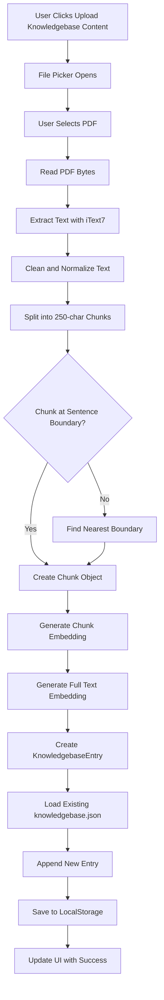
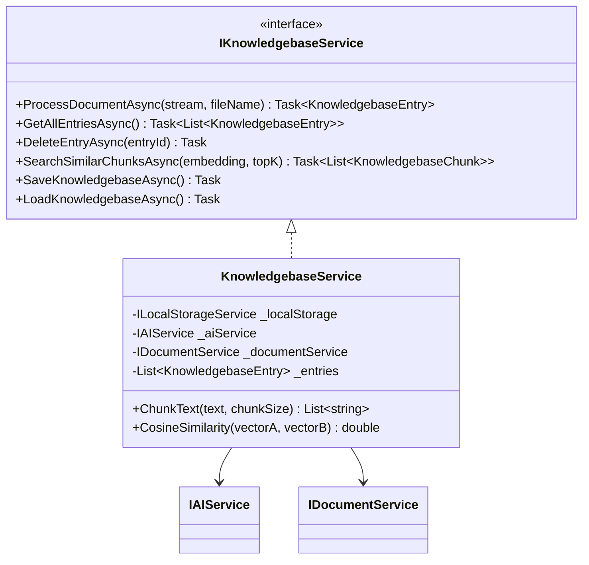

# Phase 3: Knowledgebase

## Overview

Implement the knowledgebase management system that allows users to upload PDF files, parse them, chunk text, generate embeddings, and store them for RAG retrieval.

---

## Checklist

- [ ] Create knowledgebase data models
- [ ] Implement PDF text extraction with iText7
- [ ] Implement text chunking algorithm
- [ ] Implement knowledgebase storage and retrieval
- [ ] Build knowledgebase management UI

---

## Knowledgebase Processing Flow



---

## Data Models

### KnowledgebaseEntry

```csharp
// Models/KnowledgebaseEntry.cs
public class KnowledgebaseEntry
{
    public Guid Id { get; set; } = Guid.NewGuid();
    public string FileName { get; set; }
    public string OriginalText { get; set; }
    public float[] OriginalTextEmbedding { get; set; }
    public List<KnowledgebaseChunk> Chunks { get; set; } = new();
    public DateTime CreatedAt { get; set; } = DateTime.UtcNow;
    public long FileSizeBytes { get; set; }
}
```

### KnowledgebaseChunk

```csharp
// Models/KnowledgebaseChunk.cs
public class KnowledgebaseChunk
{
    public Guid Id { get; set; } = Guid.NewGuid();
    public Guid EntryId { get; set; }
    public int Index { get; set; }
    public string Text { get; set; }
    public float[] Embedding { get; set; }
    public int StartPosition { get; set; }
    public int EndPosition { get; set; }
}
```

---

## Implementation Details

### 1. Create KnowledgebaseService Interface

```csharp
public interface IKnowledgebaseService
{
    Task<KnowledgebaseEntry> ProcessDocumentAsync(Stream fileStream, string fileName);
    Task<List<KnowledgebaseEntry>> GetAllEntriesAsync();
    Task DeleteEntryAsync(Guid entryId);
    Task<List<KnowledgebaseChunk>> SearchSimilarChunksAsync(float[] queryEmbedding, int topK = 5);
    Task SaveKnowledgebaseAsync();
    Task LoadKnowledgebaseAsync();
}
```

### 2. Implement Text Chunking Algorithm

```csharp
public List<string> ChunkText(string text, int chunkSize = 250)
{
    var chunks = new List<string>();
    var sentences = SplitIntoSentences(text);
    var currentChunk = new StringBuilder();
    
    foreach (var sentence in sentences)
    {
        if (currentChunk.Length + sentence.Length > chunkSize && currentChunk.Length > 0)
        {
            chunks.Add(currentChunk.ToString().Trim());
            currentChunk.Clear();
        }
        currentChunk.Append(sentence + " ");
    }
    
    if (currentChunk.Length > 0)
        chunks.Add(currentChunk.ToString().Trim());
    
    return chunks;
}

private List<string> SplitIntoSentences(string text)
{
    // Split on sentence boundaries: . ! ? followed by space or newline
    var pattern = @"(?<=[.!?])\s+";
    return Regex.Split(text, pattern)
        .Where(s => !string.IsNullOrWhiteSpace(s))
        .ToList();
}
```

### 3. Implement Cosine Similarity Calculation

```csharp
public double CosineSimilarity(float[] vectorA, float[] vectorB)
{
    if (vectorA.Length != vectorB.Length)
        throw new ArgumentException("Vectors must have the same length");
    
    double dotProduct = 0;
    double magnitudeA = 0;
    double magnitudeB = 0;
    
    for (int i = 0; i < vectorA.Length; i++)
    {
        dotProduct += vectorA[i] * vectorB[i];
        magnitudeA += vectorA[i] * vectorA[i];
        magnitudeB += vectorB[i] * vectorB[i];
    }
    
    if (magnitudeA == 0 || magnitudeB == 0)
        return 0;
    
    return dotProduct / (Math.Sqrt(magnitudeA) * Math.Sqrt(magnitudeB));
}
```

### 4. Create PDF Extraction Service Using iText7

```csharp
public string ExtractTextFromPdf(Stream pdfStream)
{
    using var reader = new PdfReader(pdfStream);
    using var document = new PdfDocument(reader);
    var text = new StringBuilder();
    
    for (int i = 1; i <= document.GetNumberOfPages(); i++)
    {
        var page = document.GetPage(i);
        var strategy = new SimpleTextExtractionStrategy();
        text.Append(PdfTextExtractor.GetTextFromPage(page, strategy));
        text.AppendLine(); // Add page break
    }
    
    return text.ToString();
}
```

### 5. Implement Full KnowledgebaseService

```csharp
public class KnowledgebaseService : IKnowledgebaseService
{
    private readonly ILocalStorageService _localStorage;
    private readonly IAIService _aiService;
    private readonly IDocumentService _documentService;
    
    private const string KnowledgebaseKey = "knowledgebase";
    private List<KnowledgebaseEntry> _entries = new();
    
    public KnowledgebaseService(
        ILocalStorageService localStorage,
        IAIService aiService,
        IDocumentService documentService)
    {
        _localStorage = localStorage;
        _aiService = aiService;
        _documentService = documentService;
    }
    
    public async Task<KnowledgebaseEntry> ProcessDocumentAsync(Stream fileStream, string fileName)
    {
        // Extract text from PDF
        var text = await _documentService.ExtractTextFromPdfAsync(fileStream);
        
        // Create entry
        var entry = new KnowledgebaseEntry
        {
            FileName = fileName,
            OriginalText = text,
            FileSizeBytes = fileStream.Length
        };
        
        // Generate full text embedding
        entry.OriginalTextEmbedding = await _aiService.GetEmbeddingAsync(
            text.Length > 8000 ? text.Substring(0, 8000) : text);
        
        // Chunk the text
        var chunkTexts = ChunkText(text, 250);
        
        // Generate embeddings for each chunk
        for (int i = 0; i < chunkTexts.Count; i++)
        {
            var chunk = new KnowledgebaseChunk
            {
                EntryId = entry.Id,
                Index = i,
                Text = chunkTexts[i],
                Embedding = await _aiService.GetEmbeddingAsync(chunkTexts[i])
            };
            entry.Chunks.Add(chunk);
        }
        
        // Add to collection and save
        await LoadKnowledgebaseAsync();
        _entries.Add(entry);
        await SaveKnowledgebaseAsync();
        
        return entry;
    }
    
    public async Task<List<KnowledgebaseEntry>> GetAllEntriesAsync()
    {
        await LoadKnowledgebaseAsync();
        return _entries;
    }
    
    public async Task DeleteEntryAsync(Guid entryId)
    {
        await LoadKnowledgebaseAsync();
        _entries.RemoveAll(e => e.Id == entryId);
        await SaveKnowledgebaseAsync();
    }
    
    public async Task<List<KnowledgebaseChunk>> SearchSimilarChunksAsync(float[] queryEmbedding, int topK = 5)
    {
        await LoadKnowledgebaseAsync();
        
        var allChunks = _entries.SelectMany(e => e.Chunks);
        
        var rankedChunks = allChunks
            .Select(chunk => new
            {
                Chunk = chunk,
                Score = CosineSimilarity(queryEmbedding, chunk.Embedding)
            })
            .OrderByDescending(x => x.Score)
            .Take(topK)
            .Select(x => x.Chunk)
            .ToList();
        
        return rankedChunks;
    }
    
    public async Task SaveKnowledgebaseAsync()
    {
        await _localStorage.SetItemAsync(KnowledgebaseKey, _entries);
    }
    
    public async Task LoadKnowledgebaseAsync()
    {
        var stored = await _localStorage.GetItemAsync<List<KnowledgebaseEntry>>(KnowledgebaseKey);
        _entries = stored ?? new List<KnowledgebaseEntry>();
    }
}
```

---

## UI Components

### Knowledgebase Upload Component

```razor
@* Knowledgebase Upload Section *@
<RadzenCard>
    <RadzenText TextStyle="TextStyle.H5">Knowledgebase</RadzenText>
    <RadzenUpload 
        @ref="kbUpload"
        Accept=".pdf"
        ChooseText="Upload Knowledgebase Content"
        Complete="OnKnowledgebaseUploadComplete"
        Progress="OnUploadProgress"
        Style="width: 100%" />
</RadzenCard>

@* Knowledgebase Entries List *@
<RadzenCard>
    <RadzenDataList Data="@knowledgebaseEntries" TItem="KnowledgebaseEntry">
        <Template Context="entry">
            <RadzenStack Orientation="Orientation.Horizontal" 
                         JustifyContent="JustifyContent.SpaceBetween" 
                         AlignItems="AlignItems.Center">
                <RadzenStack Gap="0">
                    <RadzenText TextStyle="TextStyle.Body1">@entry.FileName</RadzenText>
                    <RadzenText TextStyle="TextStyle.Caption">
                        @entry.Chunks.Count chunks | @FormatFileSize(entry.FileSizeBytes)
                    </RadzenText>
                </RadzenStack>
                <RadzenButton Icon="delete" 
                              ButtonStyle="ButtonStyle.Danger" 
                              Size="ButtonSize.Small"
                              Click="() => DeleteEntry(entry.Id)" />
            </RadzenStack>
        </Template>
    </RadzenDataList>
</RadzenCard>
```

### Upload Handler Code

```csharp
@code {
    private List<KnowledgebaseEntry> knowledgebaseEntries = new();
    
    protected override async Task OnInitializedAsync()
    {
        knowledgebaseEntries = await KnowledgebaseService.GetAllEntriesAsync();
    }
    
    private async Task OnKnowledgebaseUploadComplete(UploadCompleteEventArgs args)
    {
        try
        {
            using var stream = new MemoryStream(args.RawFile);
            var entry = await KnowledgebaseService.ProcessDocumentAsync(stream, args.File.Name);
            knowledgebaseEntries.Add(entry);
            
            NotificationService.Notify(NotificationSeverity.Success, "Success", 
                $"Added {entry.FileName} with {entry.Chunks.Count} chunks to knowledgebase.");
        }
        catch (Exception ex)
        {
            NotificationService.Notify(NotificationSeverity.Error, "Error", ex.Message);
        }
    }
    
    private async Task DeleteEntry(Guid entryId)
    {
        await KnowledgebaseService.DeleteEntryAsync(entryId);
        knowledgebaseEntries.RemoveAll(e => e.Id == entryId);
        NotificationService.Notify(NotificationSeverity.Info, "Deleted", "Entry removed from knowledgebase.");
    }
    
    private string FormatFileSize(long bytes)
    {
        string[] sizes = { "B", "KB", "MB", "GB" };
        int order = 0;
        double size = bytes;
        while (size >= 1024 && order < sizes.Length - 1)
        {
            order++;
            size /= 1024;
        }
        return $"{size:0.##} {sizes[order]}";
    }
}
```

---

## Service Architecture



---

## Dependency Injection Registration

```csharp
builder.Services.AddScoped<IKnowledgebaseService, KnowledgebaseService>();
builder.Services.AddScoped<IDocumentService, DocumentService>();
```

---

## Reference Links

- [iText7 Documentation](https://itextpdf.com/products/itext-7)
- [Blazored.LocalStorage](https://github.com/Blazored/LocalStorage)
