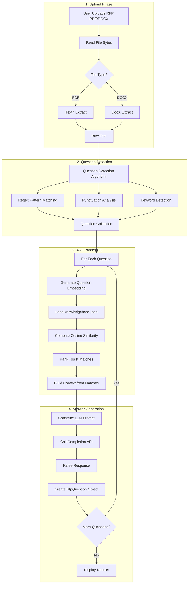
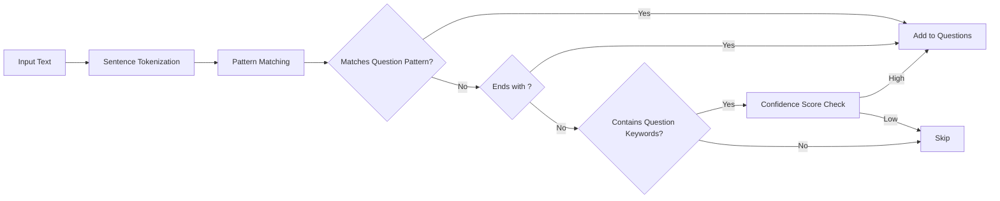
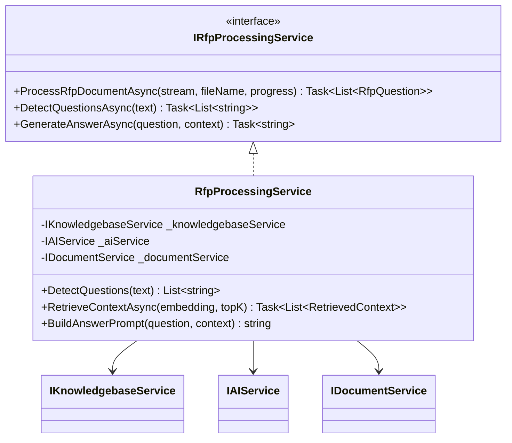

# Phase 4: RFP Processing

## Overview

Implement the RFP document processing pipeline including question detection, RAG retrieval, and AI-powered answer generation.

---

## Checklist

- [ ] Implement question detection algorithm
- [ ] Implement cosine similarity search
- [ ] Implement RAG retrieval pipeline
- [ ] Implement answer generation
- [ ] Build RFP processing UI with progress indicators

---

## RFP Processing Pipeline



---

## Question Detection Strategy



---

## Data Models

### RfpQuestion

```csharp
// Models/RfpQuestion.cs
public class RfpQuestion
{
    public Guid Id { get; set; } = Guid.NewGuid();
    public int Index { get; set; }
    public string QuestionText { get; set; }
    public float[] Embedding { get; set; }
    public string GeneratedAnswer { get; set; }
    public string EditedAnswer { get; set; }
    public List<RetrievedContext> RelevantContext { get; set; } = new();
    public double ConfidenceScore { get; set; }
    public ProcessingStatus Status { get; set; } = ProcessingStatus.Pending;
}
```

### RetrievedContext

```csharp
// Models/RetrievedContext.cs
public class RetrievedContext
{
    public Guid ChunkId { get; set; }
    public string ChunkText { get; set; }
    public double SimilarityScore { get; set; }
    public string SourceFileName { get; set; }
}
```

### ProcessingProgress

```csharp
// Models/ProcessingProgress.cs
public class ProcessingProgress
{
    public string CurrentStep { get; set; }
    public int CurrentItem { get; set; }
    public int TotalItems { get; set; }
    public double PercentComplete => TotalItems > 0 ? (CurrentItem / (double)TotalItems) * 100 : 0;
    public string Message { get; set; }
    public ProcessingStatus Status { get; set; }
}

// Models/ProcessingStatus.cs
public enum ProcessingStatus
{
    Pending,
    InProgress,
    Completed,
    Failed
}
```

---

## Implementation Details

### 1. Create RfpProcessingService Interface

```csharp
public interface IRfpProcessingService
{
    Task<List<RfpQuestion>> ProcessRfpDocumentAsync(
        Stream fileStream, 
        string fileName, 
        IProgress<ProcessingProgress> progress);
    Task<List<string>> DetectQuestionsAsync(string text);
    Task<string> GenerateAnswerAsync(RfpQuestion question, List<RetrievedContext> context);
}
```

### 2. Implement Question Detection

```csharp
public List<string> DetectQuestions(string text)
{
    var questions = new List<string>();
    var patterns = new[]
    {
        @"^\d+\.\s+.+\?$",                    // Numbered questions: "1. What is your experience?"
        @"^[A-Z][^.!]*\?$",                   // Standard questions: "What services do you offer?"
        @"(?:please|kindly)\s+(?:describe|explain|provide)",  // Imperative requests
        @"^(?:what|how|why|when|where|who|which|can|could|would|will|do|does|is|are)\s+",  // Question starters
    };
    
    var sentences = SplitIntoSentences(text);
    foreach (var sentence in sentences)
    {
        if (IsQuestion(sentence.Trim(), patterns))
            questions.Add(sentence.Trim());
    }
    
    return questions;
}

private bool IsQuestion(string sentence, string[] patterns)
{
    // Check if ends with question mark
    if (sentence.EndsWith("?"))
        return true;
    
    // Check against regex patterns
    foreach (var pattern in patterns)
    {
        if (Regex.IsMatch(sentence, pattern, RegexOptions.IgnoreCase | RegexOptions.Multiline))
            return true;
    }
    
    return false;
}

private List<string> SplitIntoSentences(string text)
{
    // Split on sentence boundaries and line breaks
    var pattern = @"(?<=[.!?\n])\s+";
    return Regex.Split(text, pattern)
        .Where(s => !string.IsNullOrWhiteSpace(s))
        .Select(s => s.Trim())
        .ToList();
}
```

### 3. Implement RAG Retrieval

```csharp
public async Task<List<RetrievedContext>> RetrieveContextAsync(float[] queryEmbedding, int topK = 5)
{
    var entries = await _knowledgebaseService.GetAllEntriesAsync();
    var allChunks = entries.SelectMany(e => e.Chunks.Select(c => new 
    { 
        Chunk = c, 
        SourceFileName = e.FileName 
    }));
    
    var rankedChunks = allChunks
        .Select(item => new
        {
            item.Chunk,
            item.SourceFileName,
            Score = CosineSimilarity(queryEmbedding, item.Chunk.Embedding)
        })
        .OrderByDescending(x => x.Score)
        .Take(topK)
        .Select(x => new RetrievedContext
        {
            ChunkId = x.Chunk.Id,
            ChunkText = x.Chunk.Text,
            SimilarityScore = x.Score,
            SourceFileName = x.SourceFileName
        })
        .ToList();
    
    return rankedChunks;
}

private double CosineSimilarity(float[] vectorA, float[] vectorB)
{
    double dotProduct = 0;
    double magnitudeA = 0;
    double magnitudeB = 0;
    
    for (int i = 0; i < vectorA.Length; i++)
    {
        dotProduct += vectorA[i] * vectorB[i];
        magnitudeA += vectorA[i] * vectorA[i];
        magnitudeB += vectorB[i] * vectorB[i];
    }
    
    return dotProduct / (Math.Sqrt(magnitudeA) * Math.Sqrt(magnitudeB));
}
```

### 4. Implement Answer Generation Prompt

```csharp
public string BuildAnswerPrompt(string question, List<RetrievedContext> context)
{
    var contextText = string.Join("\n\n", context.Select(c => c.ChunkText));
    
    return $"""
        You are an expert RFP response writer. Based on the following context from our knowledge base, 
        provide a professional, accurate, and comprehensive answer to the question.
        
        CONTEXT:
        {contextText}
        
        QUESTION:
        {question}
        
        Provide a clear, professional response suitable for an RFP submission. 
        If the context doesn't contain enough information, indicate what additional details might be needed.
        """;
}
```

### 5. Full RfpProcessingService Implementation

```csharp
public class RfpProcessingService : IRfpProcessingService
{
    private readonly IKnowledgebaseService _knowledgebaseService;
    private readonly IAIService _aiService;
    private readonly IDocumentService _documentService;
    
    public RfpProcessingService(
        IKnowledgebaseService knowledgebaseService,
        IAIService aiService,
        IDocumentService documentService)
    {
        _knowledgebaseService = knowledgebaseService;
        _aiService = aiService;
        _documentService = documentService;
    }
    
    public async Task<List<RfpQuestion>> ProcessRfpDocumentAsync(
        Stream fileStream, 
        string fileName,
        IProgress<ProcessingProgress> progress)
    {
        var questions = new List<RfpQuestion>();
        
        // Step 1: Extract text
        progress.Report(new ProcessingProgress 
        { 
            CurrentStep = "Extracting text", 
            Message = $"Processing {fileName}...",
            Status = ProcessingStatus.InProgress
        });
        
        string text;
        if (fileName.EndsWith(".pdf", StringComparison.OrdinalIgnoreCase))
            text = await _documentService.ExtractTextFromPdfAsync(fileStream);
        else if (fileName.EndsWith(".docx", StringComparison.OrdinalIgnoreCase))
            text = await _documentService.ExtractTextFromDocxAsync(fileStream);
        else
            throw new NotSupportedException("File type not supported");
        
        // Step 2: Detect questions
        progress.Report(new ProcessingProgress 
        { 
            CurrentStep = "Detecting questions", 
            Message = "Analyzing document for questions...",
            Status = ProcessingStatus.InProgress
        });
        
        var detectedQuestions = DetectQuestions(text);
        
        // Step 3: Process each question
        for (int i = 0; i < detectedQuestions.Count; i++)
        {
            progress.Report(new ProcessingProgress 
            { 
                CurrentStep = "Generating answers", 
                CurrentItem = i + 1,
                TotalItems = detectedQuestions.Count,
                Message = $"Processing question {i + 1} of {detectedQuestions.Count}...",
                Status = ProcessingStatus.InProgress
            });
            
            var question = new RfpQuestion
            {
                Index = i + 1,
                QuestionText = detectedQuestions[i],
                Status = ProcessingStatus.InProgress
            };
            
            // Generate embedding for question
            question.Embedding = await _aiService.GetEmbeddingAsync(detectedQuestions[i]);
            
            // Retrieve relevant context
            question.RelevantContext = await RetrieveContextAsync(question.Embedding, topK: 5);
            
            // Calculate confidence based on similarity scores
            question.ConfidenceScore = question.RelevantContext.Any() 
                ? question.RelevantContext.Average(c => c.SimilarityScore) 
                : 0;
            
            // Generate answer
            var prompt = BuildAnswerPrompt(question.QuestionText, question.RelevantContext);
            question.GeneratedAnswer = await _aiService.GetCompletionAsync(prompt);
            question.EditedAnswer = question.GeneratedAnswer; // Default to generated
            question.Status = ProcessingStatus.Completed;
            
            questions.Add(question);
        }
        
        progress.Report(new ProcessingProgress 
        { 
            CurrentStep = "Complete", 
            CurrentItem = detectedQuestions.Count,
            TotalItems = detectedQuestions.Count,
            Message = $"Processed {detectedQuestions.Count} questions successfully.",
            Status = ProcessingStatus.Completed
        });
        
        return questions;
    }
    
    public async Task<List<string>> DetectQuestionsAsync(string text)
    {
        return await Task.FromResult(DetectQuestions(text));
    }
    
    public async Task<string> GenerateAnswerAsync(RfpQuestion question, List<RetrievedContext> context)
    {
        var prompt = BuildAnswerPrompt(question.QuestionText, context);
        return await _aiService.GetCompletionAsync(prompt);
    }
}
```

---

## UI Components

### RFP Upload Component

```razor
@* RFP Upload Section *@
<RadzenCard>
    <RadzenText TextStyle="TextStyle.H5">RFP Document</RadzenText>
    <RadzenUpload 
        @ref="rfpUpload"
        Accept=".pdf,.docx"
        ChooseText="Upload RFP"
        Complete="OnRfpUploadComplete"
        Progress="OnUploadProgress"
        Style="width: 100%" />
</RadzenCard>
```

### Progress Display

```razor
<RadzenCard Visible="@isProcessing">
    <RadzenText TextStyle="TextStyle.H6">@currentProgress.CurrentStep</RadzenText>
    <RadzenProgressBar 
        Value="@currentProgress.PercentComplete" 
        ShowValue="true"
        Style="height: 24px; margin: 10px 0;" />
    <RadzenText TextStyle="TextStyle.Body2">@currentProgress.Message</RadzenText>
</RadzenCard>
```

### Questions/Answers DataGrid

```razor
<RadzenDataGrid 
    @ref="qaGrid"
    Data="@questions"
    TItem="RfpQuestion"
    AllowFiltering="true"
    AllowSorting="true"
    AllowPaging="true"
    PageSize="10"
    PagerPosition="PagerPosition.Bottom">
    
    <Columns>
        <RadzenDataGridColumn TItem="RfpQuestion" Property="Index" Title="#" Width="60px" />
        
        <RadzenDataGridColumn TItem="RfpQuestion" Property="QuestionText" Title="Question">
            <Template Context="question">
                <RadzenText>@question.QuestionText</RadzenText>
            </Template>
        </RadzenDataGridColumn>
        
        <RadzenDataGridColumn TItem="RfpQuestion" Title="Answer" Width="50%">
            <Template Context="question">
                <RadzenTextArea 
                    @bind-Value="question.EditedAnswer"
                    Placeholder="@question.GeneratedAnswer"
                    Rows="4"
                    Style="width: 100%;" />
            </Template>
        </RadzenDataGridColumn>
        
        <RadzenDataGridColumn TItem="RfpQuestion" Property="ConfidenceScore" Title="Confidence" Width="100px">
            <Template Context="question">
                <RadzenBadge 
                    BadgeStyle="@GetConfidenceBadgeStyle(question.ConfidenceScore)"
                    Text="@($"{question.ConfidenceScore:P0}")" />
            </Template>
        </RadzenDataGridColumn>
    </Columns>
</RadzenDataGrid>
```

### Code-Behind for UI

```csharp
@code {
    private List<RfpQuestion> questions = new();
    private ProcessingProgress currentProgress = new();
    private bool isProcessing = false;
    
    private async Task OnRfpUploadComplete(UploadCompleteEventArgs args)
    {
        isProcessing = true;
        StateHasChanged();
        
        try
        {
            var progress = new Progress<ProcessingProgress>(p =>
            {
                currentProgress = p;
                InvokeAsync(StateHasChanged);
            });
            
            using var stream = new MemoryStream(args.RawFile);
            questions = await RfpProcessingService.ProcessRfpDocumentAsync(
                stream, 
                args.File.Name, 
                progress);
            
            NotificationService.Notify(NotificationSeverity.Success, "Complete", 
                $"Processed {questions.Count} questions.");
        }
        catch (Exception ex)
        {
            NotificationService.Notify(NotificationSeverity.Error, "Error", ex.Message);
        }
        finally
        {
            isProcessing = false;
            StateHasChanged();
        }
    }
    
    private BadgeStyle GetConfidenceBadgeStyle(double score)
    {
        return score switch
        {
            >= 0.8 => BadgeStyle.Success,
            >= 0.5 => BadgeStyle.Warning,
            _ => BadgeStyle.Danger
        };
    }
}
```

---

## Service Architecture



---

## Dependency Injection Registration

```csharp
builder.Services.AddScoped<IRfpProcessingService, RfpProcessingService>();
```
