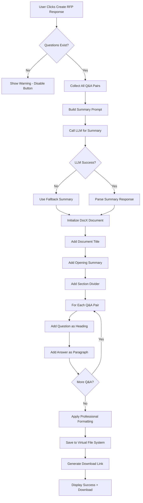
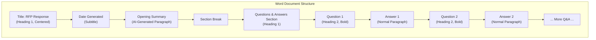
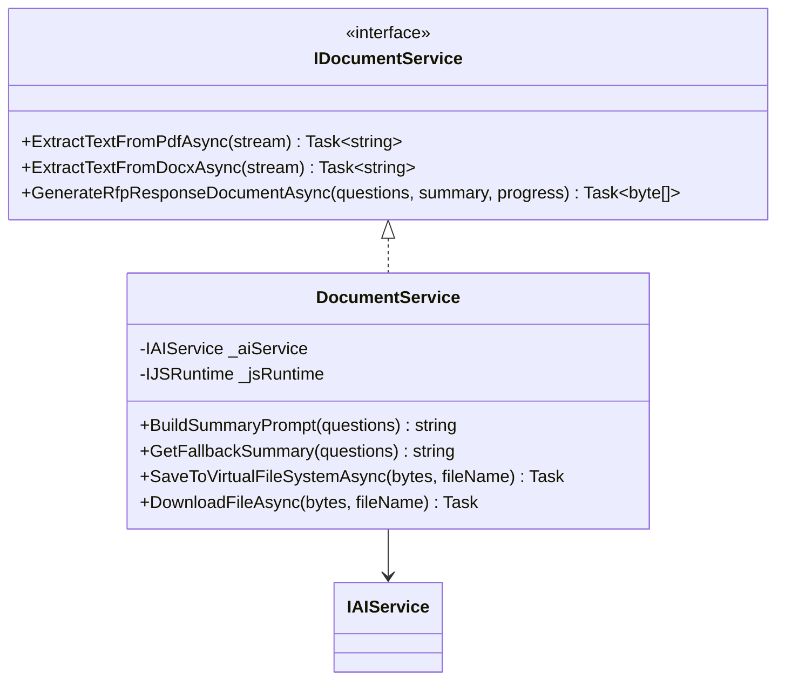

# Phase 5: Document Generation

## Overview

Implement the RFP response document generation system that creates professional Word documents with AI-generated summaries and formatted Q&A sections.

---

## Checklist

- [ ] Implement summary generation
- [ ] Implement Word document generation with DocX
- [ ] Implement document download functionality
- [ ] Build export UI with validation

---

## Document Generation Flow



---

## Document Structure



---

## Implementation Details

### 1. Create DocumentService Interface

```csharp
public interface IDocumentService
{
    Task<string> ExtractTextFromPdfAsync(Stream pdfStream);
    Task<string> ExtractTextFromDocxAsync(Stream docxStream);
    Task<byte[]> GenerateRfpResponseDocumentAsync(
        List<RfpQuestion> questions, 
        string summary,
        IProgress<ProcessingProgress> progress);
}
```

### 2. Implement Summary Generation Prompt

```csharp
public string BuildSummaryPrompt(List<RfpQuestion> questions)
{
    var qaText = string.Join("\n\n", questions.Select(q => 
        $"Q: {q.QuestionText}\nA: {q.EditedAnswer ?? q.GeneratedAnswer}"));
    
    return $"""
        You are an expert RFP response writer. Based on the following questions and answers 
        from an RFP response, write a professional executive summary paragraph that:
        
        1. Introduces the responding organization's capabilities
        2. Highlights key strengths demonstrated in the responses
        3. Expresses enthusiasm for the opportunity
        4. Is concise (2-3 paragraphs maximum)
        
        QUESTIONS AND ANSWERS:
        {qaText}
        
        Write the executive summary now:
        """;
}
```

### 3. Implement Fallback Summary

```csharp
private string GetFallbackSummary(List<RfpQuestion> questions)
{
    return $"""
        Thank you for the opportunity to respond to this Request for Proposal. 
        We have carefully reviewed all {questions.Count} questions and have provided 
        comprehensive responses that demonstrate our capabilities and commitment to 
        delivering exceptional results. We look forward to discussing our proposal 
        in further detail.
        """;
}
```

### 4. Implement Word Document Generation with DocX

```csharp
public async Task<byte[]> GenerateRfpResponseDocumentAsync(
    List<RfpQuestion> questions, 
    string summary,
    IProgress<ProcessingProgress> progress = null)
{
    progress?.Report(new ProcessingProgress 
    { 
        CurrentStep = "Creating document", 
        Message = "Initializing Word document...",
        Status = ProcessingStatus.InProgress
    });
    
    using var memoryStream = new MemoryStream();
    using var document = DocX.Create(memoryStream);
    
    // Document Settings
    document.MarginLeft = 72f;    // 1 inch
    document.MarginRight = 72f;
    document.MarginTop = 72f;
    document.MarginBottom = 72f;
    
    // Title
    var title = document.InsertParagraph("RFP Response");
    title.FontSize(24)
         .Bold()
         .Font("Calibri")
         .Color(Color.FromArgb(31, 73, 125));
    title.Alignment = Alignment.center;
    
    // Date
    var date = document.InsertParagraph($"Generated: {DateTime.Now:MMMM dd, yyyy}");
    date.FontSize(12)
        .Italic()
        .Font("Calibri")
        .Color(Color.Gray);
    date.Alignment = Alignment.center;
    
    document.InsertParagraph(); // Spacer
    
    // Horizontal Rule
    var rule = document.InsertParagraph();
    rule.InsertHorizontalLine();
    
    document.InsertParagraph(); // Spacer
    
    // Executive Summary Section
    progress?.Report(new ProcessingProgress 
    { 
        CurrentStep = "Adding summary", 
        Message = "Writing executive summary...",
        Status = ProcessingStatus.InProgress
    });
    
    var summaryHeader = document.InsertParagraph("Executive Summary");
    summaryHeader.FontSize(16)
                 .Bold()
                 .Font("Calibri")
                 .Color(Color.FromArgb(31, 73, 125));
    summaryHeader.SpacingAfter(10);
    
    var summaryText = document.InsertParagraph(summary);
    summaryText.FontSize(11)
               .Font("Calibri")
               .LineSpacingAfter = 15f;
    
    document.InsertParagraph(); // Spacer
    
    // Questions & Answers Section
    var qaHeader = document.InsertParagraph("Questions and Responses");
    qaHeader.FontSize(16)
            .Bold()
            .Font("Calibri")
            .Color(Color.FromArgb(31, 73, 125));
    qaHeader.SpacingAfter(15);
    
    progress?.Report(new ProcessingProgress 
    { 
        CurrentStep = "Adding Q&A", 
        CurrentItem = 0,
        TotalItems = questions.Count,
        Message = "Writing questions and answers...",
        Status = ProcessingStatus.InProgress
    });
    
    foreach (var question in questions)
    {
        progress?.Report(new ProcessingProgress 
        { 
            CurrentStep = "Adding Q&A", 
            CurrentItem = question.Index,
            TotalItems = questions.Count,
            Message = $"Writing question {question.Index} of {questions.Count}...",
            Status = ProcessingStatus.InProgress
        });
        
        // Question
        var qPara = document.InsertParagraph($"Q{question.Index}: {question.QuestionText}");
        qPara.FontSize(12)
             .Bold()
             .Font("Calibri")
             .Color(Color.FromArgb(79, 129, 189));
        qPara.SpacingAfter(5);
        
        // Answer
        var answerText = question.EditedAnswer ?? question.GeneratedAnswer;
        var aPara = document.InsertParagraph(answerText);
        aPara.FontSize(11)
             .Font("Calibri");
        aPara.SpacingAfter(20);
    }
    
    // Footer
    document.InsertParagraph(); // Spacer
    var footer = document.InsertParagraph($"Document generated on {DateTime.Now:f}");
    footer.FontSize(9)
          .Italic()
          .Font("Calibri")
          .Color(Color.Gray);
    footer.Alignment = Alignment.right;
    
    document.Save();
    
    progress?.Report(new ProcessingProgress 
    { 
        CurrentStep = "Complete", 
        CurrentItem = questions.Count,
        TotalItems = questions.Count,
        Message = "Document generated successfully!",
        Status = ProcessingStatus.Completed
    });
    
    return memoryStream.ToArray();
}
```

### 5. Full DocumentService Implementation

```csharp
public class DocumentService : IDocumentService
{
    private readonly IAIService _aiService;
    private readonly IJSRuntime _jsRuntime;
    
    public DocumentService(IAIService aiService, IJSRuntime jsRuntime)
    {
        _aiService = aiService;
        _jsRuntime = jsRuntime;
    }
    
    public async Task<string> ExtractTextFromPdfAsync(Stream pdfStream)
    {
        using var reader = new PdfReader(pdfStream);
        using var document = new PdfDocument(reader);
        var text = new StringBuilder();
        
        for (int i = 1; i <= document.GetNumberOfPages(); i++)
        {
            var page = document.GetPage(i);
            var strategy = new SimpleTextExtractionStrategy();
            text.Append(PdfTextExtractor.GetTextFromPage(page, strategy));
            text.AppendLine();
        }
        
        return text.ToString();
    }
    
    public async Task<string> ExtractTextFromDocxAsync(Stream docxStream)
    {
        using var document = DocX.Load(docxStream);
        var text = new StringBuilder();
        
        foreach (var paragraph in document.Paragraphs)
        {
            text.AppendLine(paragraph.Text);
        }
        
        return text.ToString();
    }
    
    public async Task<byte[]> GenerateRfpResponseDocumentAsync(
        List<RfpQuestion> questions,
        string summary,
        IProgress<ProcessingProgress> progress = null)
    {
        // Generate summary if not provided
        if (string.IsNullOrWhiteSpace(summary))
        {
            try
            {
                var prompt = BuildSummaryPrompt(questions);
                summary = await _aiService.GetCompletionAsync(prompt);
            }
            catch
            {
                summary = GetFallbackSummary(questions);
            }
        }
        
        // Generate the document (implementation above)
        return await GenerateDocumentAsync(questions, summary, progress);
    }
    
    private string BuildSummaryPrompt(List<RfpQuestion> questions)
    {
        var qaText = string.Join("\n\n", questions.Select(q => 
            $"Q: {q.QuestionText}\nA: {q.EditedAnswer ?? q.GeneratedAnswer}"));
        
        return $"""
            You are an expert RFP response writer. Based on the following questions and answers 
            from an RFP response, write a professional executive summary paragraph that:
            
            1. Introduces the responding organization's capabilities
            2. Highlights key strengths demonstrated in the responses
            3. Expresses enthusiasm for the opportunity
            4. Is concise (2-3 paragraphs maximum)
            
            QUESTIONS AND ANSWERS:
            {qaText}
            
            Write the executive summary now:
            """;
    }
    
    private string GetFallbackSummary(List<RfpQuestion> questions)
    {
        return $"""
            Thank you for the opportunity to respond to this Request for Proposal. 
            We have carefully reviewed all {questions.Count} questions and have provided 
            comprehensive responses that demonstrate our capabilities and commitment to 
            delivering exceptional results. We look forward to discussing our proposal 
            in further detail.
            """;
    }
}
```

### 6. Virtual File System Integration

```csharp
public async Task SaveToVirtualFileSystemAsync(byte[] documentBytes, string fileName)
{
    // Use Blazor WebAssembly File System Access API
    var fileHandle = await _jsRuntime.InvokeAsync<IJSObjectReference>(
        "showSaveFilePicker", 
        new { 
            suggestedName = fileName, 
            types = new[] { 
                new { 
                    accept = new { 
                        "application/vnd.openxmlformats-officedocument.wordprocessingml.document" = new[] { ".docx" } 
                    } 
                } 
            } 
        });
    
    var writable = await fileHandle.InvokeAsync<IJSObjectReference>("createWritable");
    await writable.InvokeVoidAsync("write", documentBytes);
    await writable.InvokeVoidAsync("close");
}

public async Task DownloadFileAsync(byte[] documentBytes, string fileName)
{
    // Alternative: trigger browser download
    var base64 = Convert.ToBase64String(documentBytes);
    await _jsRuntime.InvokeVoidAsync("downloadFile", fileName, base64);
}
```

JavaScript helper for download:

```javascript
// wwwroot/js/fileDownload.js
window.downloadFile = function(fileName, base64Content) {
    const link = document.createElement('a');
    link.href = 'data:application/vnd.openxmlformats-officedocument.wordprocessingml.document;base64,' + base64Content;
    link.download = fileName;
    document.body.appendChild(link);
    link.click();
    document.body.removeChild(link);
}
```

---

## UI Components

### Export Button

```razor
<RadzenStack Orientation="Orientation.Horizontal" Gap="10px" JustifyContent="JustifyContent.End">
    <RadzenButton 
        Text="Create RFP Response"
        Icon="download"
        ButtonStyle="ButtonStyle.Primary"
        Size="ButtonSize.Large"
        Click="OnCreateRfpResponse"
        Disabled="@(!questions.Any() || isProcessing)"
        IsBusy="@isExporting" />
</RadzenStack>
```

### Export Handler Code

```csharp
@code {
    private bool isExporting = false;
    
    private async Task OnCreateRfpResponse()
    {
        if (!questions.Any())
        {
            NotificationService.Notify(NotificationSeverity.Warning, "No Questions", 
                "Please upload and process an RFP document first.");
            return;
        }
        
        isExporting = true;
        StateHasChanged();
        
        try
        {
            var progress = new Progress<ProcessingProgress>(p =>
            {
                currentProgress = p;
                InvokeAsync(StateHasChanged);
            });
            
            // Generate document
            var documentBytes = await DocumentService.GenerateRfpResponseDocumentAsync(
                questions, 
                null,  // Let the service generate summary
                progress);
            
            // Trigger download
            var fileName = $"RFP_Response_{DateTime.Now:yyyyMMdd_HHmmss}.docx";
            await FileSystemService.DownloadFileAsync(documentBytes, fileName);
            
            NotificationService.Notify(NotificationSeverity.Success, "Success", 
                "RFP Response document has been generated and downloaded.");
        }
        catch (Exception ex)
        {
            NotificationService.Notify(NotificationSeverity.Error, "Error", 
                $"Failed to generate document: {ex.Message}");
        }
        finally
        {
            isExporting = false;
            StateHasChanged();
        }
    }
}
```

---

## Service Architecture



---

## Dependency Injection Registration

```csharp
builder.Services.AddScoped<IDocumentService, DocumentService>();
```

---

## Reference Links

- [DocX (Xceed) Documentation](https://github.com/xceedsoftware/DocX)
- [iText7 Documentation](https://itextpdf.com/products/itext-7)
- [Blazor WebAssembly Virtual File System](https://blazorhelpwebsite.com/ViewBlogPost/17069)
