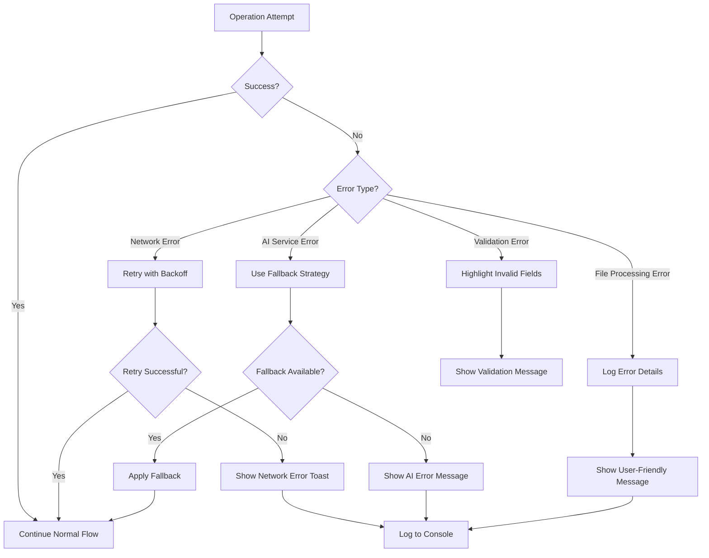
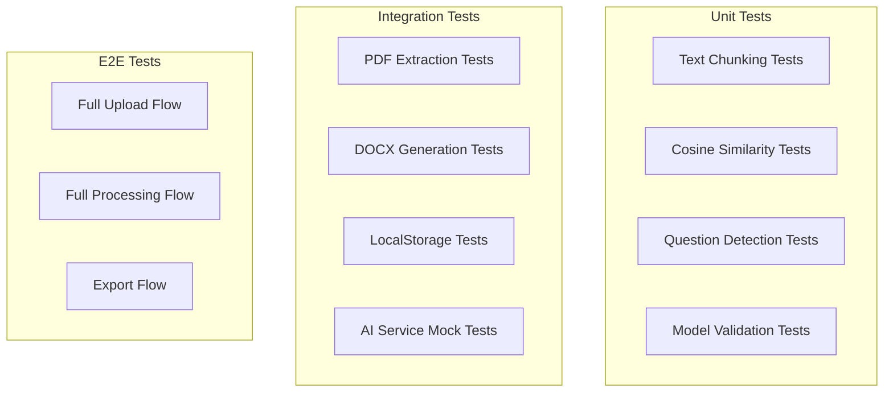

# Phase 6: Polish

## Overview

Final phase focused on comprehensive error handling, performance optimization, loading states, testing, and UI polish to ensure a production-ready application.

---

## Checklist

- [ ] Implement comprehensive error handling
- [ ] Add loading states and progress indicators
- [ ] Optimize performance
- [ ] Write unit and integration tests
- [ ] UI polish based on mockups

---

## Error Handling Strategy

### Error Handling Flow



### Error Handling Implementation

```csharp
public class ErrorHandler
{
    private readonly NotificationService _notificationService;
    private readonly ILogger<ErrorHandler> _logger;
    
    public ErrorHandler(NotificationService notificationService, ILogger<ErrorHandler> logger)
    {
        _notificationService = notificationService;
        _logger = logger;
    }
    
    public async Task<T> ExecuteWithRetryAsync<T>(
        Func<Task<T>> operation,
        int maxRetries = 3,
        string errorMessage = "Operation failed")
    {
        int attempt = 0;
        Exception lastException = null;
        
        while (attempt < maxRetries)
        {
            try
            {
                return await operation();
            }
            catch (HttpRequestException ex)
            {
                lastException = ex;
                attempt++;
                _logger.LogWarning(ex, "Attempt {Attempt} failed. Retrying...", attempt);
                await Task.Delay(TimeSpan.FromSeconds(Math.Pow(2, attempt))); // Exponential backoff
            }
            catch (Exception ex)
            {
                _logger.LogError(ex, "Non-retryable error occurred");
                throw;
            }
        }
        
        _notificationService.Notify(NotificationSeverity.Error, "Error", errorMessage);
        _logger.LogError(lastException, "All retry attempts failed");
        throw lastException;
    }
    
    public async Task<T> ExecuteWithFallbackAsync<T>(
        Func<Task<T>> operation,
        Func<T> fallback,
        string operationName)
    {
        try
        {
            return await operation();
        }
        catch (Exception ex)
        {
            _logger.LogWarning(ex, "Operation {Operation} failed, using fallback", operationName);
            _notificationService.Notify(NotificationSeverity.Warning, "Notice", 
                $"Using fallback for {operationName}");
            return fallback();
        }
    }
    
    public string GetFallbackResponse(string operationType)
    {
        return operationType switch
        {
            "summary" => "Thank you for the opportunity to respond to this RFP. We have provided comprehensive responses to all questions and look forward to discussing our proposal further.",
            "answer" => "Unable to generate answer automatically. Please provide a manual response.",
            "embedding" => null, // Signal to skip embedding
            _ => "An error occurred. Please try again."
        };
    }
}
```

### Global Exception Handler

```csharp
// ErrorBoundary component
@using Microsoft.AspNetCore.Components.Web

<ErrorBoundary @ref="errorBoundary">
    <ChildContent>
        @ChildContent
    </ChildContent>
    <ErrorContent Context="exception">
        <RadzenCard Style="background-color: #fee; border: 1px solid #fcc; padding: 20px;">
            <RadzenStack Gap="10px">
                <RadzenText TextStyle="TextStyle.H5" Style="color: #c00;">
                    <RadzenIcon Icon="error" /> An error occurred
                </RadzenText>
                <RadzenText>@GetUserFriendlyMessage(exception)</RadzenText>
                <RadzenButton Text="Try Again" Click="Recover" ButtonStyle="ButtonStyle.Secondary" />
            </RadzenStack>
        </RadzenCard>
    </ErrorContent>
</ErrorBoundary>

@code {
    [Parameter] public RenderFragment ChildContent { get; set; }
    
    private ErrorBoundary errorBoundary;
    
    private void Recover()
    {
        errorBoundary?.Recover();
    }
    
    private string GetUserFriendlyMessage(Exception ex)
    {
        return ex switch
        {
            HttpRequestException => "Network error. Please check your connection and try again.",
            InvalidOperationException when ex.Message.Contains("AI") => 
                "AI service is not configured. Please configure your AI provider in settings.",
            FileNotFoundException => "The requested file could not be found.",
            _ => "Something went wrong. Please try again or contact support."
        };
    }
}
```

---

## Loading States and Progress Indicators

### Centralized Loading State Manager

```csharp
public class LoadingStateManager
{
    private readonly Dictionary<string, bool> _loadingStates = new();
    public event Action OnStateChanged;
    
    public bool IsLoading(string key) => _loadingStates.TryGetValue(key, out var state) && state;
    
    public bool IsAnyLoading => _loadingStates.Values.Any(v => v);
    
    public IDisposable BeginLoading(string key)
    {
        _loadingStates[key] = true;
        OnStateChanged?.Invoke();
        return new LoadingScope(this, key);
    }
    
    private void EndLoading(string key)
    {
        _loadingStates[key] = false;
        OnStateChanged?.Invoke();
    }
    
    private class LoadingScope : IDisposable
    {
        private readonly LoadingStateManager _manager;
        private readonly string _key;
        
        public LoadingScope(LoadingStateManager manager, string key)
        {
            _manager = manager;
            _key = key;
        }
        
        public void Dispose() => _manager.EndLoading(_key);
    }
}
```

### Loading Overlay Component

```razor
@* LoadingOverlay.razor *@
<div class="loading-overlay @(IsVisible ? "visible" : "")" style="@GetStyle()">
    <RadzenStack AlignItems="AlignItems.Center" Gap="20px">
        <RadzenProgressBarCircular 
            ShowValue="false" 
            Mode="ProgressBarMode.Indeterminate" 
            Size="ProgressBarCircularSize.Large" />
        <RadzenText TextStyle="TextStyle.H6">@Message</RadzenText>
        @if (ShowProgress)
        {
            <RadzenProgressBar 
                Value="@ProgressPercent" 
                ShowValue="true"
                Style="width: 300px;" />
        }
    </RadzenStack>
</div>

@code {
    [Parameter] public bool IsVisible { get; set; }
    [Parameter] public string Message { get; set; } = "Loading...";
    [Parameter] public bool ShowProgress { get; set; }
    [Parameter] public double ProgressPercent { get; set; }
    
    private string GetStyle()
    {
        return IsVisible 
            ? "display: flex; opacity: 1;" 
            : "display: none; opacity: 0;";
    }
}

<style>
    .loading-overlay {
        position: fixed;
        top: 0;
        left: 0;
        right: 0;
        bottom: 0;
        background: rgba(255, 255, 255, 0.9);
        justify-content: center;
        align-items: center;
        z-index: 9999;
        transition: opacity 0.3s ease;
    }
</style>
```

### Skeleton Loading Components

```razor
@* SkeletonCard.razor *@
<RadzenCard Style="@GetStyle()">
    <RadzenStack Gap="10px">
        <div class="skeleton skeleton-title"></div>
        <div class="skeleton skeleton-text"></div>
        <div class="skeleton skeleton-text short"></div>
    </RadzenStack>
</RadzenCard>

<style>
    .skeleton {
        background: linear-gradient(90deg, #f0f0f0 25%, #e0e0e0 50%, #f0f0f0 75%);
        background-size: 200% 100%;
        animation: shimmer 1.5s infinite;
        border-radius: 4px;
    }
    
    .skeleton-title {
        height: 24px;
        width: 60%;
    }
    
    .skeleton-text {
        height: 16px;
        width: 100%;
    }
    
    .skeleton-text.short {
        width: 40%;
    }
    
    @@keyframes shimmer {
        0% { background-position: -200% 0; }
        100% { background-position: 200% 0; }
    }
</style>
```

---

## Performance Optimization

### 1. Virtualization for Large Lists

```razor
@* Use Virtualize for large data sets *@
<RadzenDataGrid 
    Data="@questions"
    TItem="RfpQuestion"
    AllowVirtualization="true"
    Style="height: 500px;">
    @* columns *@
</RadzenDataGrid>
```

### 2. Debounced Search

```csharp
public class DebouncedAction
{
    private CancellationTokenSource _cts;
    private readonly int _delayMs;
    
    public DebouncedAction(int delayMs = 300)
    {
        _delayMs = delayMs;
    }
    
    public async Task ExecuteAsync(Func<Task> action)
    {
        _cts?.Cancel();
        _cts = new CancellationTokenSource();
        
        try
        {
            await Task.Delay(_delayMs, _cts.Token);
            await action();
        }
        catch (TaskCanceledException)
        {
            // Expected when cancelled
        }
    }
}
```

### 3. Lazy Loading Services

```csharp
// Only initialize AI client when needed
public class LazyAIService : IAIService
{
    private readonly Lazy<Task<IChatClient>> _chatClient;
    
    public LazyAIService(ILocalStorageService localStorage)
    {
        _chatClient = new Lazy<Task<IChatClient>>(async () =>
        {
            var settings = await localStorage.GetItemAsync<AIProviderSettings>("ai_settings");
            return CreateClient(settings);
        });
    }
    
    public async Task<string> GetCompletionAsync(string prompt)
    {
        var client = await _chatClient.Value;
        return await client.GetCompletionAsync(prompt);
    }
}
```

### 4. Memory Management

```csharp
// Dispose large objects properly
public class KnowledgebaseService : IKnowledgebaseService, IDisposable
{
    private List<KnowledgebaseEntry> _entries;
    private bool _disposed;
    
    public void Dispose()
    {
        if (!_disposed)
        {
            _entries?.Clear();
            _entries = null;
            _disposed = true;
        }
    }
}
```

---

## Testing Strategy

### Test Categories



### Key Test Cases

| Test Area | Test Case | Expected Result |
|-----------|-----------|-----------------|
| Chunking | 250-char chunks with sentence boundaries | Chunks ≤ 250 chars, split at sentences |
| Chunking | Empty input | Empty list returned |
| Similarity | Identical vectors | Similarity = 1.0 |
| Similarity | Orthogonal vectors | Similarity = 0.0 |
| Questions | Text ending with ? | Detected as question |
| Questions | Numbered list format | Detected as questions |
| PDF | Valid PDF upload | Text extracted successfully |
| PDF | Corrupted PDF | Graceful error handling |
| DOCX | Generate with Q&A | Valid document created |
| AI | Service unavailable | Fallback response used |

### Unit Test Examples

```csharp
[TestClass]
public class TextChunkingTests
{
    private KnowledgebaseService _service;
    
    [TestInitialize]
    public void Setup()
    {
        _service = new KnowledgebaseService(null, null, null);
    }
    
    [TestMethod]
    public void ChunkText_WithValidInput_ReturnsChunksUnder250Chars()
    {
        // Arrange
        var text = "This is a test sentence. This is another sentence. And one more sentence here.";
        
        // Act
        var chunks = _service.ChunkText(text, 250);
        
        // Assert
        Assert.IsTrue(chunks.All(c => c.Length <= 250));
    }
    
    [TestMethod]
    public void ChunkText_WithEmptyInput_ReturnsEmptyList()
    {
        // Arrange
        var text = "";
        
        // Act
        var chunks = _service.ChunkText(text, 250);
        
        // Assert
        Assert.AreEqual(0, chunks.Count);
    }
    
    [TestMethod]
    public void ChunkText_PreservesSentenceBoundaries()
    {
        // Arrange
        var text = "First sentence. Second sentence. Third sentence.";
        
        // Act
        var chunks = _service.ChunkText(text, 30);
        
        // Assert
        Assert.IsTrue(chunks.All(c => c.EndsWith(".") || c.EndsWith(". ")));
    }
}

[TestClass]
public class CosineSimilarityTests
{
    [TestMethod]
    public void CosineSimilarity_IdenticalVectors_ReturnsOne()
    {
        var vector = new float[] { 1, 2, 3 };
        var result = CosineSimilarity(vector, vector);
        Assert.AreEqual(1.0, result, 0.0001);
    }
    
    [TestMethod]
    public void CosineSimilarity_OrthogonalVectors_ReturnsZero()
    {
        var vectorA = new float[] { 1, 0, 0 };
        var vectorB = new float[] { 0, 1, 0 };
        var result = CosineSimilarity(vectorA, vectorB);
        Assert.AreEqual(0.0, result, 0.0001);
    }
}

[TestClass]
public class QuestionDetectionTests
{
    private RfpProcessingService _service;
    
    [TestMethod]
    public void DetectQuestions_TextEndingWithQuestionMark_Detected()
    {
        var text = "What is your experience?";
        var questions = _service.DetectQuestions(text);
        Assert.AreEqual(1, questions.Count);
    }
    
    [TestMethod]
    public void DetectQuestions_NumberedQuestions_Detected()
    {
        var text = "1. What services do you offer?\n2. How much does it cost?";
        var questions = _service.DetectQuestions(text);
        Assert.AreEqual(2, questions.Count);
    }
}
```

### Integration Test Examples

```csharp
[TestClass]
public class DocumentServiceIntegrationTests
{
    [TestMethod]
    public async Task GenerateDocument_WithValidQuestions_CreatesValidDocx()
    {
        // Arrange
        var questions = new List<RfpQuestion>
        {
            new() { Index = 1, QuestionText = "Test question?", GeneratedAnswer = "Test answer." }
        };
        var service = new DocumentService(null, null);
        
        // Act
        var bytes = await service.GenerateRfpResponseDocumentAsync(questions, "Summary", null);
        
        // Assert
        Assert.IsNotNull(bytes);
        Assert.IsTrue(bytes.Length > 0);
        
        // Verify it's a valid DOCX (ZIP format)
        using var ms = new MemoryStream(bytes);
        using var archive = new ZipArchive(ms, ZipArchiveMode.Read);
        Assert.IsTrue(archive.Entries.Any(e => e.Name == "document.xml"));
    }
}
```

---

## UI Polish

### Responsive Layout

```css
/* Responsive grid adjustments */
@@media (max-width: 768px) {
    .main-content {
        flex-direction: column;
    }
    
    .sidebar {
        width: 100%;
        margin-bottom: 20px;
    }
    
    .content-area {
        width: 100%;
    }
}
```

### Consistent Spacing and Typography

```css
:root {
    --spacing-xs: 4px;
    --spacing-sm: 8px;
    --spacing-md: 16px;
    --spacing-lg: 24px;
    --spacing-xl: 32px;
    
    --font-heading: 'Segoe UI', sans-serif;
    --font-body: 'Segoe UI', sans-serif;
    
    --color-primary: #1f4979;
    --color-secondary: #4f81bd;
    --color-success: #28a745;
    --color-warning: #ffc107;
    --color-danger: #dc3545;
}
```

### Accessibility Improvements

```razor
@* Ensure proper ARIA labels *@
<RadzenButton 
    Text="Upload"
    aria-label="Upload knowledgebase document"
    title="Click to upload a PDF document to the knowledgebase" />

@* Keyboard navigation support *@
<RadzenDataGrid 
    KeyDown="HandleKeyDown"
    tabindex="0">
```

### Animation and Transitions

```css
/* Smooth transitions */
.card {
    transition: box-shadow 0.2s ease, transform 0.2s ease;
}

.card:hover {
    box-shadow: 0 4px 12px rgba(0, 0, 0, 0.15);
    transform: translateY(-2px);
}

/* Loading animation */
@@keyframes fadeIn {
    from { opacity: 0; }
    to { opacity: 1; }
}

.fade-in {
    animation: fadeIn 0.3s ease-in;
}
```

---

## Final Checklist Before Release

- [ ] All error states have user-friendly messages
- [ ] Loading indicators shown for all async operations
- [ ] Retry logic implemented for network failures
- [ ] Fallbacks available for AI service failures
- [ ] Unit tests cover core business logic
- [ ] Integration tests verify service interactions
- [ ] UI matches mockup designs
- [ ] Responsive design works on tablet/mobile
- [ ] Keyboard navigation works throughout
- [ ] Console is free of errors/warnings
- [ ] Performance profiled and optimized
- [ ] Memory leaks addressed
