# RFP Responder Implementation Plan

## Executive Summary

This document provides a comprehensive implementation plan for the RFP Responder application—a Blazor WebAssembly + Server (Hybrid) application that enables users to upload PDF documents, build a knowledgebase, and generate professional RFP responses using AI-powered Retrieval-Augmented Generation (RAG).

---

## Table of Contents

1. [System Architecture](#system-architecture)
2. [Technology Stack](#technology-stack)
3. [Project Structure](#project-structure)
4. [Feature Implementation](#feature-implementation)
   - [AI Provider Configuration](#ai-provider-configuration)
   - [Knowledgebase Management](#knowledgebase-management)
   - [RFP Processing](#rfp-processing)
   - [RFP Response Generation](#rfp-response-generation)
5. [Data Models](#data-models)
6. [Service Layer Design](#service-layer-design)
7. [UI Components](#ui-components)
8. [Error Handling Strategy](#error-handling-strategy)
9. [Testing Strategy](#testing-strategy)

---

## System Architecture

### High-Level Architecture Diagram

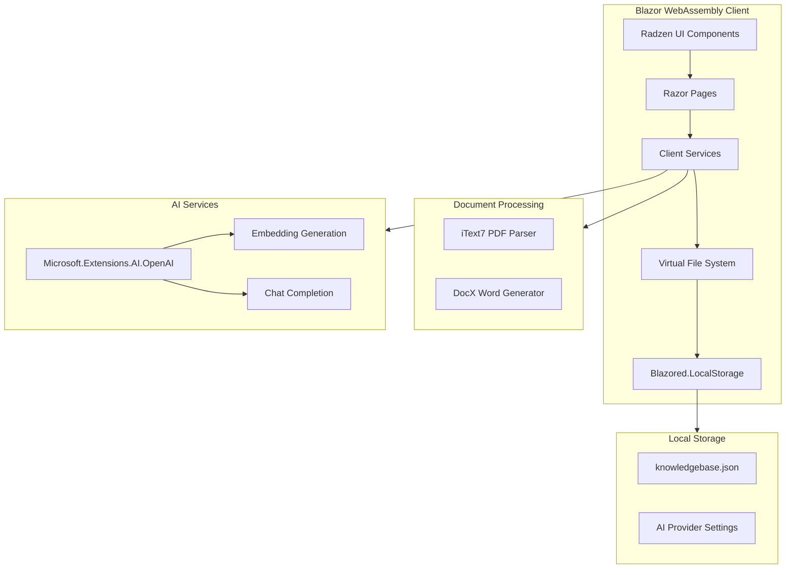

### Component Interaction Flow

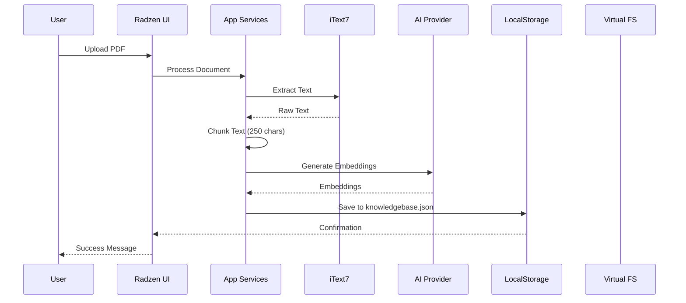

---

## Technology Stack

### NuGet Packages

| Package | Version | Purpose |
|---------|---------|---------|
| `Blazored.LocalStorage` | Latest | Persistent browser storage for knowledgebase and settings |
| `iText7` | Latest | PDF parsing and text extraction |
| `DocX` (Xceed) | 4.0.25105.5786 | Word document generation and export |
| `Microsoft.Extensions.AI.OpenAI` | Latest | LLM embedding and completion calls |
| `Radzen.Blazor` | Latest | UI components, theming, and DataGrid |

### Framework Requirements

- **.NET 10** (Blazor 10)
- **Blazor WebAssembly + Server (Hybrid)** with `InteractiveWebAssembly` render mode
- **Blazor WebAssembly Virtual File System Access API** for local file operations

---

## Project Structure

```
RFPCreatorAgentic/
├── BlazorWebApp/                          # Server-side host project
│   ├── Program.cs
│   ├── App.razor
│   ├── _Imports.razor
│   └── Components/
│       └── Layout/
│           └── MainLayout.razor
│
├── BlazorWebApp.Client/                   # Client WASM project
│   ├── Program.cs
│   ├── _Imports.razor
│   ├── wwwroot/
│   │   └── css/
│   ├── Components/
│   │   └── Pages/
│   │       ├── Home.razor
│   │       ├── Home.razor.cs
│   │       └── Dialogs/
│   │           └── ConfigureAIDialog.razor
│   ├── Services/
│   │   ├── IKnowledgebaseService.cs
│   │   ├── KnowledgebaseService.cs
│   │   ├── IRfpProcessingService.cs
│   │   ├── RfpProcessingService.cs
│   │   ├── IDocumentService.cs
│   │   ├── DocumentService.cs
│   │   ├── IAIService.cs
│   │   ├── AIService.cs
│   │   ├── IFileSystemService.cs
│   │   └── FileSystemService.cs
│   └── Models/
│       ├── KnowledgebaseEntry.cs
│       ├── KnowledgebaseChunk.cs
│       ├── RfpQuestion.cs
│       ├── RfpResponse.cs
│       └── AIProviderSettings.cs
│
└── docs/
    ├── RFP-Responder-Implementation-Plan.md
    ├── HomePage.png
    ├── ReviewAndEditRFPAnswers.png
    ├── Processing.png
    └── ExportProposal.png
```

---

## Feature Implementation

### AI Provider Configuration

#### Overview

Allow multiple AI providers to be configured and persisted using `Blazored.LocalStorage`. Settings are loaded at application startup.

#### Configuration Dialog Flow

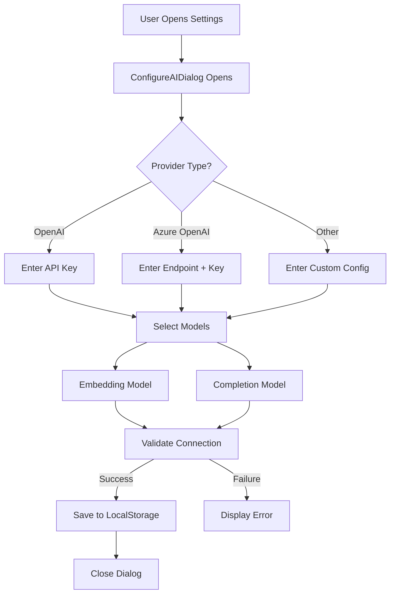

#### Implementation Steps

1. **Create `AIProviderSettings` model**
   ```csharp
   public class AIProviderSettings
   {
       public string ProviderType { get; set; } // "OpenAI", "AzureOpenAI", etc.
       public string ApiKey { get; set; }
       public string Endpoint { get; set; }
       public string EmbeddingModel { get; set; }
       public string CompletionModel { get; set; }
       public DateTime LastUpdated { get; set; }
   }
   ```

2. **Create `ConfigureAIDialog.razor`**
   - Use Radzen Dialog component
   - Form fields for provider selection and credentials
   - Model selection dropdowns for embedding and completion
   - Connection test button
   - Reference: [ConfigureAIDialog.razor](https://github.com/Blazor-Data-Orchestrator/BlazorDataOrchestrator/blob/main/src/BlazorOrchestrator.Web/Components/Pages/Dialogs/ConfigureAIDialog.razor)

3. **Create `IAIService` interface and `AIService` implementation**
   - Initialize `Microsoft.Extensions.AI.OpenAI` client
   - Methods: `GetEmbeddingAsync()`, `GetCompletionAsync()`, `TestConnectionAsync()`
   - Load settings from `Blazored.LocalStorage` at startup

4. **Register services in `Program.cs`**
   ```csharp
   builder.Services.AddBlazoredLocalStorage();
   builder.Services.AddScoped<IAIService, AIService>();
   ```

---

### Knowledgebase Management

#### Overview

Users upload PDF files to build a knowledgebase. Documents are parsed, chunked, embedded, and stored persistently.

#### Knowledgebase Processing Flow

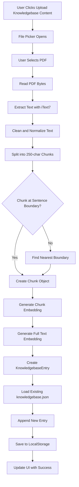

#### Data Models

```csharp
public class KnowledgebaseEntry
{
    public Guid Id { get; set; }
    public string FileName { get; set; }
    public string OriginalText { get; set; }
    public float[] OriginalTextEmbedding { get; set; }
    public List<KnowledgebaseChunk> Chunks { get; set; }
    public DateTime CreatedAt { get; set; }
}

public class KnowledgebaseChunk
{
    public Guid Id { get; set; }
    public Guid EntryId { get; set; }
    public int Index { get; set; }
    public string Text { get; set; }
    public float[] Embedding { get; set; }
}
```

#### Implementation Steps

1. **Create `IKnowledgebaseService` interface**
   ```csharp
   public interface IKnowledgebaseService
   {
       Task<KnowledgebaseEntry> ProcessDocumentAsync(Stream fileStream, string fileName);
       Task<List<KnowledgebaseEntry>> GetAllEntriesAsync();
       Task DeleteEntryAsync(Guid entryId);
       Task<List<KnowledgebaseChunk>> SearchSimilarChunksAsync(float[] queryEmbedding, int topK = 5);
       Task SaveKnowledgebaseAsync();
       Task LoadKnowledgebaseAsync();
   }
   ```

2. **Implement text chunking algorithm**
   ```csharp
   public List<string> ChunkText(string text, int chunkSize = 250)
   {
       var chunks = new List<string>();
       var sentences = SplitIntoSentences(text);
       var currentChunk = new StringBuilder();
       
       foreach (var sentence in sentences)
       {
           if (currentChunk.Length + sentence.Length > chunkSize && currentChunk.Length > 0)
           {
               chunks.Add(currentChunk.ToString().Trim());
               currentChunk.Clear();
           }
           currentChunk.Append(sentence + " ");
       }
       
       if (currentChunk.Length > 0)
           chunks.Add(currentChunk.ToString().Trim());
       
       return chunks;
   }
   ```

3. **Implement cosine similarity calculation**
   ```csharp
   public double CosineSimilarity(float[] vectorA, float[] vectorB)
   {
       double dotProduct = 0;
       double magnitudeA = 0;
       double magnitudeB = 0;
       
       for (int i = 0; i < vectorA.Length; i++)
       {
           dotProduct += vectorA[i] * vectorB[i];
           magnitudeA += vectorA[i] * vectorA[i];
           magnitudeB += vectorB[i] * vectorB[i];
       }
       
       return dotProduct / (Math.Sqrt(magnitudeA) * Math.Sqrt(magnitudeB));
   }
   ```

4. **Create PDF extraction service using iText7**
   ```csharp
   public string ExtractTextFromPdf(Stream pdfStream)
   {
       using var reader = new PdfReader(pdfStream);
       using var document = new PdfDocument(reader);
       var text = new StringBuilder();
       
       for (int i = 1; i <= document.GetNumberOfPages(); i++)
       {
           var page = document.GetPage(i);
           var strategy = new SimpleTextExtractionStrategy();
           text.Append(PdfTextExtractor.GetTextFromPage(page, strategy));
       }
       
       return text.ToString();
   }
   ```

---

### RFP Processing

#### Overview

Process uploaded RFP documents to detect questions, perform RAG retrieval, and generate AI-powered answers.

#### RFP Processing Pipeline

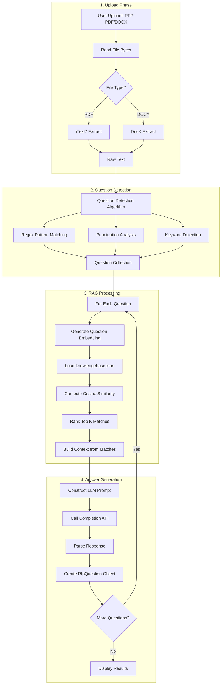

#### Question Detection Strategy

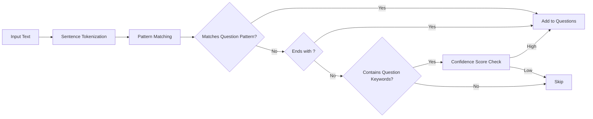

#### Data Models

```csharp
public class RfpQuestion
{
    public Guid Id { get; set; }
    public int Index { get; set; }
    public string QuestionText { get; set; }
    public float[] Embedding { get; set; }
    public string GeneratedAnswer { get; set; }
    public string EditedAnswer { get; set; }
    public List<RetrievedContext> RelevantContext { get; set; }
    public double ConfidenceScore { get; set; }
}

public class RetrievedContext
{
    public Guid ChunkId { get; set; }
    public string ChunkText { get; set; }
    public double SimilarityScore { get; set; }
}
```

#### Implementation Steps

1. **Create `IRfpProcessingService` interface**
   ```csharp
   public interface IRfpProcessingService
   {
       Task<List<RfpQuestion>> ProcessRfpDocumentAsync(Stream fileStream, string fileName, IProgress<ProcessingProgress> progress);
       Task<List<string>> DetectQuestionsAsync(string text);
       Task<string> GenerateAnswerAsync(RfpQuestion question, List<RetrievedContext> context);
   }
   ```

2. **Implement question detection**
   ```csharp
   public List<string> DetectQuestions(string text)
   {
       var questions = new List<string>();
       var patterns = new[]
       {
           @"^\d+\.\s+.+\?$",                    // Numbered questions
           @"^[A-Z][^.!]*\?$",                   // Standard questions
           @"(?:please|kindly)\s+(?:describe|explain|provide)",  // Imperative requests
           @"^(?:what|how|why|when|where|who|which|can|could|would|will|do|does|is|are)\s+",  // Question starters
       };
       
       var sentences = SplitIntoSentences(text);
       foreach (var sentence in sentences)
       {
           if (IsQuestion(sentence, patterns))
               questions.Add(sentence.Trim());
       }
       
       return questions;
   }
   ```

3. **Implement RAG retrieval**
   ```csharp
   public async Task<List<RetrievedContext>> RetrieveContextAsync(float[] queryEmbedding, int topK = 5)
   {
       var knowledgebase = await _knowledgebaseService.LoadKnowledgebaseAsync();
       var allChunks = knowledgebase.SelectMany(e => e.Chunks);
       
       var rankedChunks = allChunks
           .Select(chunk => new
           {
               Chunk = chunk,
               Score = CosineSimilarity(queryEmbedding, chunk.Embedding)
           })
           .OrderByDescending(x => x.Score)
           .Take(topK)
           .Select(x => new RetrievedContext
           {
               ChunkId = x.Chunk.Id,
               ChunkText = x.Chunk.Text,
               SimilarityScore = x.Score
           })
           .ToList();
       
       return rankedChunks;
   }
   ```

4. **Implement answer generation prompt**
   ```csharp
   public string BuildAnswerPrompt(string question, List<RetrievedContext> context)
   {
       var contextText = string.Join("\n\n", context.Select(c => c.ChunkText));
       
       return $"""
           You are an expert RFP response writer. Based on the following context from our knowledge base, 
           provide a professional, accurate, and comprehensive answer to the question.
           
           CONTEXT:
           {contextText}
           
           QUESTION:
           {question}
           
           Provide a clear, professional response suitable for an RFP submission. 
           If the context doesn't contain enough information, indicate what additional details might be needed.
           """;
   }
   ```

---

### RFP Response Generation

#### Overview

Generate a professional Word document containing an AI-generated summary, all questions, and their corresponding answers.

#### Document Generation Flow

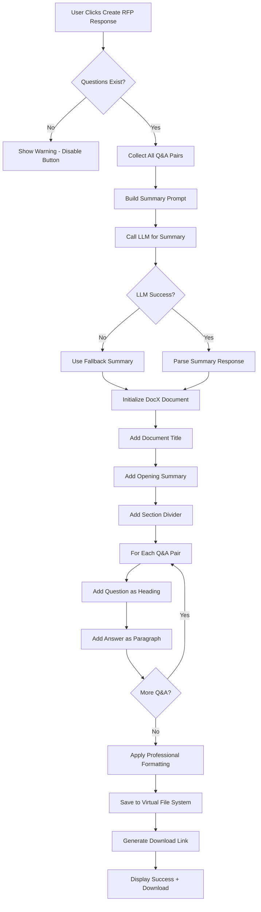

#### Document Structure

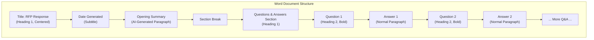

#### Implementation Steps

1. **Create `IDocumentService` interface**
   ```csharp
   public interface IDocumentService
   {
       Task<byte[]> GenerateRfpResponseDocumentAsync(
           List<RfpQuestion> questions, 
           string summary,
           IProgress<ProcessingProgress> progress);
       Task<string> ExtractTextFromDocxAsync(Stream docxStream);
   }
   ```

2. **Implement Word document generation with DocX**
   ```csharp
   public async Task<byte[]> GenerateRfpResponseDocumentAsync(
       List<RfpQuestion> questions, 
       string summary)
   {
       using var memoryStream = new MemoryStream();
       using var document = DocX.Create(memoryStream);
       
       // Title
       var title = document.InsertParagraph("RFP Response");
       title.FontSize(24).Bold().Alignment = Alignment.center;
       
       // Date
       var date = document.InsertParagraph($"Generated: {DateTime.Now:MMMM dd, yyyy}");
       date.FontSize(12).Italic().Alignment = Alignment.center;
       
       document.InsertParagraph(); // Spacer
       
       // Summary Section
       var summaryHeader = document.InsertParagraph("Executive Summary");
       summaryHeader.FontSize(16).Bold();
       
       var summaryText = document.InsertParagraph(summary);
       summaryText.FontSize(11);
       
       document.InsertParagraph(); // Spacer
       
       // Questions & Answers
       var qaHeader = document.InsertParagraph("Questions and Responses");
       qaHeader.FontSize(16).Bold();
       
       foreach (var question in questions)
       {
           var qPara = document.InsertParagraph($"Q{question.Index}: {question.QuestionText}");
           qPara.FontSize(12).Bold().SpacingAfter(5);
           
           var aPara = document.InsertParagraph(question.EditedAnswer ?? question.GeneratedAnswer);
           aPara.FontSize(11).SpacingAfter(15);
       }
       
       document.Save();
       return memoryStream.ToArray();
   }
   ```

3. **Implement summary generation prompt**
   ```csharp
   public string BuildSummaryPrompt(List<RfpQuestion> questions)
   {
       var qaText = string.Join("\n\n", questions.Select(q => 
           $"Q: {q.QuestionText}\nA: {q.EditedAnswer ?? q.GeneratedAnswer}"));
       
       return $"""
           You are an expert RFP response writer. Based on the following questions and answers 
           from an RFP response, write a professional executive summary paragraph that:
           
           1. Introduces the responding organization's capabilities
           2. Highlights key strengths demonstrated in the responses
           3. Expresses enthusiasm for the opportunity
           4. Is concise (2-3 paragraphs maximum)
           
           QUESTIONS AND ANSWERS:
           {qaText}
           
           Write the executive summary now:
           """;
   }
   ```

4. **Implement fallback summary**
   ```csharp
   private string GetFallbackSummary(List<RfpQuestion> questions)
   {
       return $"""
           Thank you for the opportunity to respond to this Request for Proposal. 
           We have carefully reviewed all {questions.Count} questions and have provided 
           comprehensive responses that demonstrate our capabilities and commitment to 
           delivering exceptional results. We look forward to discussing our proposal 
           in further detail.
           """;
   }
   ```

5. **Virtual File System integration**
   ```csharp
   public async Task SaveToVirtualFileSystemAsync(byte[] documentBytes, string fileName)
   {
       // Use Blazor WebAssembly File System Access API
       var fileHandle = await _jsRuntime.InvokeAsync<IJSObjectReference>(
           "showSaveFilePicker", 
           new { suggestedName = fileName, types = new[] { new { accept = new { "application/vnd.openxmlformats-officedocument.wordprocessingml.document" = new[] { ".docx" } } } } });
       
       var writable = await fileHandle.InvokeAsync<IJSObjectReference>("createWritable");
       await writable.InvokeVoidAsync("write", documentBytes);
       await writable.InvokeVoidAsync("close");
   }
   ```

---

## Data Models

### Complete Model Definitions

```csharp
// Models/AIProviderSettings.cs
public class AIProviderSettings
{
    public string Id { get; set; } = Guid.NewGuid().ToString();
    public string ProviderType { get; set; } = "OpenAI";
    public string DisplayName { get; set; }
    public string ApiKey { get; set; }
    public string Endpoint { get; set; }
    public string EmbeddingModel { get; set; } = "text-embedding-ada-002";
    public string CompletionModel { get; set; } = "gpt-4";
    public bool IsActive { get; set; }
    public DateTime CreatedAt { get; set; } = DateTime.UtcNow;
    public DateTime LastUpdated { get; set; } = DateTime.UtcNow;
}

// Models/KnowledgebaseEntry.cs
public class KnowledgebaseEntry
{
    public Guid Id { get; set; } = Guid.NewGuid();
    public string FileName { get; set; }
    public string OriginalText { get; set; }
    public float[] OriginalTextEmbedding { get; set; }
    public List<KnowledgebaseChunk> Chunks { get; set; } = new();
    public DateTime CreatedAt { get; set; } = DateTime.UtcNow;
    public long FileSizeBytes { get; set; }
}

// Models/KnowledgebaseChunk.cs
public class KnowledgebaseChunk
{
    public Guid Id { get; set; } = Guid.NewGuid();
    public Guid EntryId { get; set; }
    public int Index { get; set; }
    public string Text { get; set; }
    public float[] Embedding { get; set; }
    public int StartPosition { get; set; }
    public int EndPosition { get; set; }
}

// Models/RfpQuestion.cs
public class RfpQuestion
{
    public Guid Id { get; set; } = Guid.NewGuid();
    public int Index { get; set; }
    public string QuestionText { get; set; }
    public float[] Embedding { get; set; }
    public string GeneratedAnswer { get; set; }
    public string EditedAnswer { get; set; }
    public List<RetrievedContext> RelevantContext { get; set; } = new();
    public double ConfidenceScore { get; set; }
    public ProcessingStatus Status { get; set; } = ProcessingStatus.Pending;
}

// Models/RetrievedContext.cs
public class RetrievedContext
{
    public Guid ChunkId { get; set; }
    public string ChunkText { get; set; }
    public double SimilarityScore { get; set; }
    public string SourceFileName { get; set; }
}

// Models/ProcessingProgress.cs
public class ProcessingProgress
{
    public string CurrentStep { get; set; }
    public int CurrentItem { get; set; }
    public int TotalItems { get; set; }
    public double PercentComplete => TotalItems > 0 ? (CurrentItem / (double)TotalItems) * 100 : 0;
    public string Message { get; set; }
    public ProcessingStatus Status { get; set; }
}

// Models/ProcessingStatus.cs
public enum ProcessingStatus
{
    Pending,
    InProgress,
    Completed,
    Failed
}
```

---

## Service Layer Design

### Service Architecture

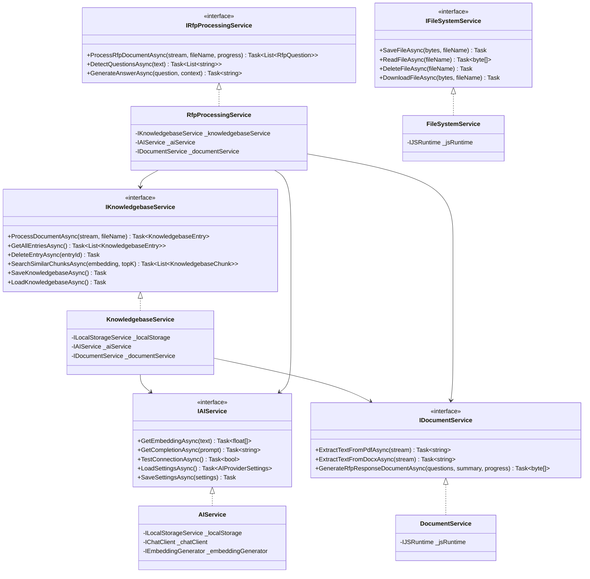

### Dependency Injection Registration

```csharp
// Program.cs (Client)
builder.Services.AddBlazoredLocalStorage();
builder.Services.AddRadzenComponents();

builder.Services.AddScoped<IAIService, AIService>();
builder.Services.AddScoped<IKnowledgebaseService, KnowledgebaseService>();
builder.Services.AddScoped<IRfpProcessingService, RfpProcessingService>();
builder.Services.AddScoped<IDocumentService, DocumentService>();
builder.Services.AddScoped<IFileSystemService, FileSystemService>();
```

---

## UI Components

### Home Page Layout

Based on the mockups, implement the following layout using Radzen components:

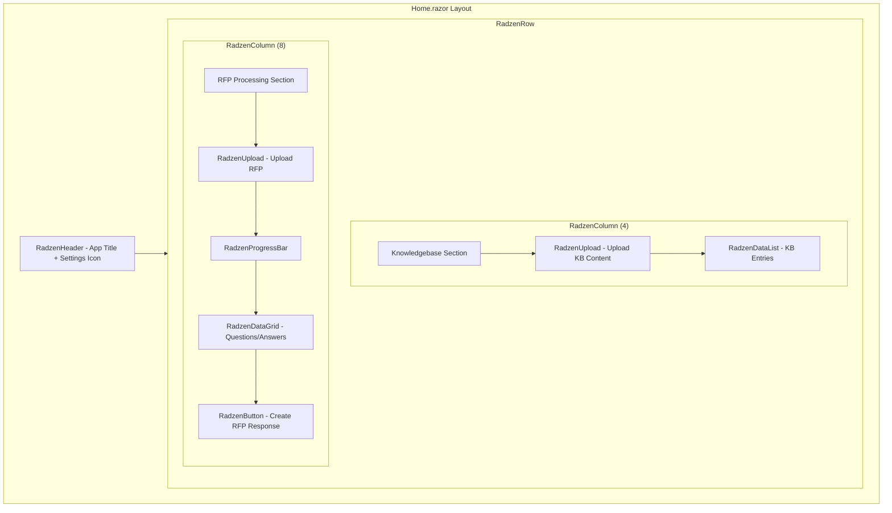

### Component Specifications

#### 1. Upload Components

```razor
@* Knowledgebase Upload *@
<RadzenCard>
    <RadzenText TextStyle="TextStyle.H5">Knowledgebase</RadzenText>
    <RadzenUpload 
        @ref="kbUpload"
        Accept=".pdf"
        ChooseText="Upload Knowledgebase Content"
        Complete="OnKnowledgebaseUploadComplete"
        Progress="OnUploadProgress"
        Style="width: 100%" />
</RadzenCard>

@* RFP Upload *@
<RadzenCard>
    <RadzenText TextStyle="TextStyle.H5">RFP Document</RadzenText>
    <RadzenUpload 
        @ref="rfpUpload"
        Accept=".pdf,.docx"
        ChooseText="Upload RFP"
        Complete="OnRfpUploadComplete"
        Progress="OnUploadProgress"
        Style="width: 100%" />
</RadzenCard>
```

#### 2. Progress Display

```razor
<RadzenCard Visible="@isProcessing">
    <RadzenText TextStyle="TextStyle.H6">@currentProgress.CurrentStep</RadzenText>
    <RadzenProgressBar 
        Value="@currentProgress.PercentComplete" 
        ShowValue="true"
        Style="height: 24px; margin: 10px 0;" />
    <RadzenText TextStyle="TextStyle.Body2">@currentProgress.Message</RadzenText>
</RadzenCard>
```

#### 3. Questions/Answers DataGrid

```razor
<RadzenDataGrid 
    @ref="qaGrid"
    Data="@questions"
    TItem="RfpQuestion"
    AllowFiltering="true"
    AllowSorting="true"
    AllowPaging="true"
    PageSize="10"
    PagerPosition="PagerPosition.Bottom">
    
    <Columns>
        <RadzenDataGridColumn TItem="RfpQuestion" Property="Index" Title="#" Width="60px" />
        
        <RadzenDataGridColumn TItem="RfpQuestion" Property="QuestionText" Title="Question">
            <Template Context="question">
                <RadzenText>@question.QuestionText</RadzenText>
            </Template>
        </RadzenDataGridColumn>
        
        <RadzenDataGridColumn TItem="RfpQuestion" Title="Answer" Width="50%">
            <Template Context="question">
                <RadzenTextArea 
                    @bind-Value="question.EditedAnswer"
                    Placeholder="@question.GeneratedAnswer"
                    Rows="4"
                    Style="width: 100%;" />
            </Template>
        </RadzenDataGridColumn>
        
        <RadzenDataGridColumn TItem="RfpQuestion" Property="ConfidenceScore" Title="Confidence" Width="100px">
            <Template Context="question">
                <RadzenBadge 
                    BadgeStyle="@GetConfidenceBadgeStyle(question.ConfidenceScore)"
                    Text="@($"{question.ConfidenceScore:P0}")" />
            </Template>
        </RadzenDataGridColumn>
    </Columns>
</RadzenDataGrid>
```

#### 4. Export Button

```razor
<RadzenStack Orientation="Orientation.Horizontal" Gap="10px" JustifyContent="JustifyContent.End">
    <RadzenButton 
        Text="Create RFP Response"
        Icon="download"
        ButtonStyle="ButtonStyle.Primary"
        Size="ButtonSize.Large"
        Click="OnCreateRfpResponse"
        Disabled="@(!questions.Any() || isProcessing)" />
</RadzenStack>
```

### Dialog Components

#### Configure AI Dialog

```razor
@* ConfigureAIDialog.razor *@
<RadzenDialog>
    <RadzenTemplateForm TItem="AIProviderSettings" Data="@settings" Submit="OnSubmit">
        <RadzenStack Gap="1rem">
            <RadzenFormField Text="Provider Type">
                <RadzenDropDown 
                    @bind-Value="settings.ProviderType"
                    Data="@providerTypes"
                    Style="width: 100%;" />
            </RadzenFormField>
            
            <RadzenFormField Text="API Key">
                <RadzenPassword 
                    @bind-Value="settings.ApiKey"
                    Style="width: 100%;" />
            </RadzenFormField>
            
            <RadzenFormField Text="Endpoint" Visible="@(settings.ProviderType == "AzureOpenAI")">
                <RadzenTextBox 
                    @bind-Value="settings.Endpoint"
                    Style="width: 100%;" />
            </RadzenFormField>
            
            <RadzenFormField Text="Embedding Model">
                <RadzenDropDown 
                    @bind-Value="settings.EmbeddingModel"
                    Data="@embeddingModels"
                    Style="width: 100%;" />
            </RadzenFormField>
            
            <RadzenFormField Text="Completion Model">
                <RadzenDropDown 
                    @bind-Value="settings.CompletionModel"
                    Data="@completionModels"
                    Style="width: 100%;" />
            </RadzenFormField>
            
            <RadzenStack Orientation="Orientation.Horizontal" Gap="10px" JustifyContent="JustifyContent.End">
                <RadzenButton Text="Test Connection" Click="OnTestConnection" ButtonStyle="ButtonStyle.Secondary" />
                <RadzenButton Text="Save" ButtonType="ButtonType.Submit" ButtonStyle="ButtonStyle.Primary" />
            </RadzenStack>
        </RadzenStack>
    </RadzenTemplateForm>
</RadzenDialog>
```

---

## Error Handling Strategy

### Error Handling Flow

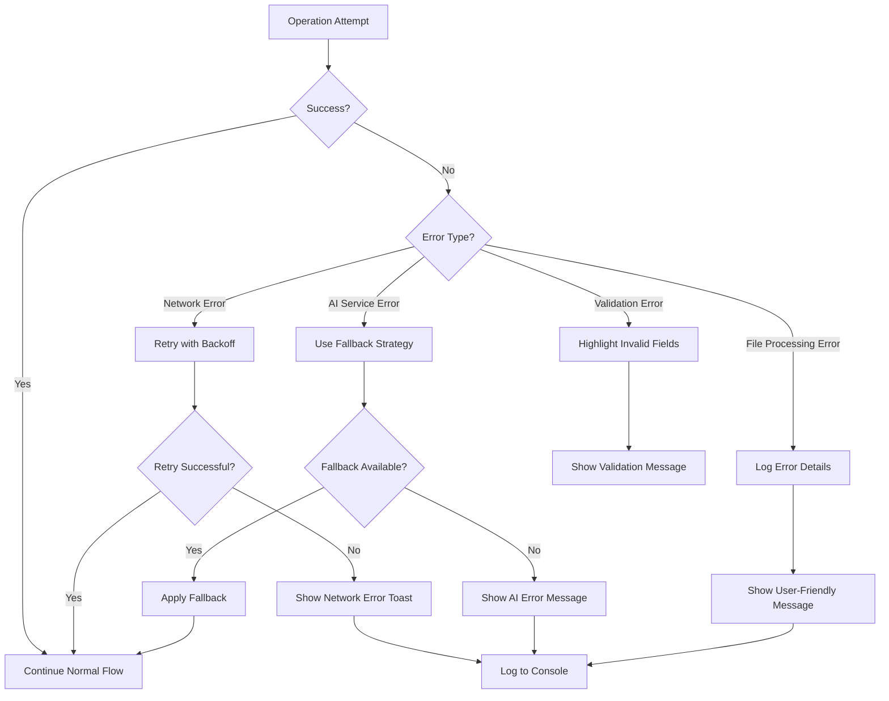

### Error Handling Implementation

```csharp
public class ErrorHandler
{
    private readonly NotificationService _notificationService;
    
    public async Task<T> ExecuteWithRetryAsync<T>(
        Func<Task<T>> operation,
        int maxRetries = 3,
        string errorMessage = "Operation failed")
    {
        int attempt = 0;
        Exception lastException = null;
        
        while (attempt < maxRetries)
        {
            try
            {
                return await operation();
            }
            catch (HttpRequestException ex)
            {
                lastException = ex;
                attempt++;
                await Task.Delay(TimeSpan.FromSeconds(Math.Pow(2, attempt)));
            }
        }
        
        _notificationService.Notify(NotificationSeverity.Error, "Error", errorMessage);
        throw lastException;
    }
    
    public string GetFallbackResponse(string operationType)
    {
        return operationType switch
        {
            "summary" => "Thank you for the opportunity to respond to this RFP...",
            "answer" => "Unable to generate answer. Please provide a manual response.",
            _ => "An error occurred. Please try again."
        };
    }
}
```

---

## Testing Strategy

### Test Categories

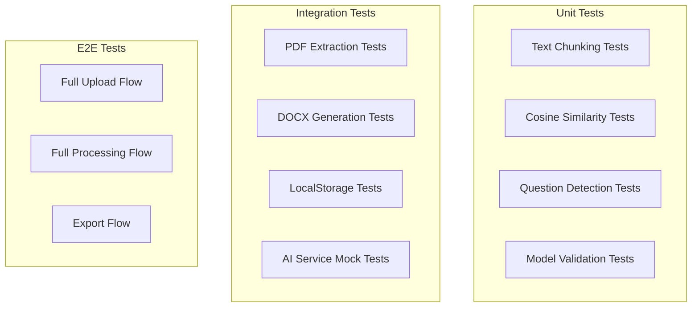

### Key Test Cases

| Test Area | Test Case | Expected Result |
|-----------|-----------|-----------------|
| Chunking | 250-char chunks with sentence boundaries | Chunks ≤ 250 chars, split at sentences |
| Chunking | Empty input | Empty list returned |
| Similarity | Identical vectors | Similarity = 1.0 |
| Similarity | Orthogonal vectors | Similarity = 0.0 |
| Questions | Text ending with ? | Detected as question |
| Questions | Numbered list format | Detected as questions |
| PDF | Valid PDF upload | Text extracted successfully |
| PDF | Corrupted PDF | Graceful error handling |
| DOCX | Generate with Q&A | Valid document created |
| AI | Service unavailable | Fallback response used |

---

## Implementation Checklist

### Phase 1: Foundation
- [ ] Create Blazor WebAssembly + Server project structure
- [ ] Configure Radzen Blazor components and theming
- [ ] Set up Blazored.LocalStorage
- [ ] Implement Virtual File System service

### Phase 2: AI Integration
- [ ] Create AI provider settings model
- [ ] Implement ConfigureAIDialog
- [ ] Create AIService with Microsoft.Extensions.AI.OpenAI
- [ ] Implement embedding generation
- [ ] Implement chat completion

### Phase 3: Knowledgebase
- [ ] Create knowledgebase data models
- [ ] Implement PDF text extraction with iText7
- [ ] Implement text chunking algorithm
- [ ] Implement knowledgebase storage and retrieval
- [ ] Build knowledgebase management UI

### Phase 4: RFP Processing
- [ ] Implement question detection algorithm
- [ ] Implement cosine similarity search
- [ ] Implement RAG retrieval pipeline
- [ ] Implement answer generation
- [ ] Build RFP processing UI with progress indicators

### Phase 5: Document Generation
- [ ] Implement summary generation
- [ ] Implement Word document generation with DocX
- [ ] Implement document download functionality
- [ ] Build export UI with validation

### Phase 6: Polish
- [ ] Implement comprehensive error handling
- [ ] Add loading states and progress indicators
- [ ] Optimize performance
- [ ] Write unit and integration tests
- [ ] UI polish based on mockups

---

## Appendix: Reference Links

- [Blazor WebAssembly Virtual File System](https://blazorhelpwebsite.com/ViewBlogPost/17069)
- [Radzen Blazor Documentation](https://razor.radzen.com)
- [Radzen Setup Guide](https://razor.radzen.com/get-started?theme=default)
- [ConfigureAIDialog Reference](https://github.com/Blazor-Data-Orchestrator/BlazorDataOrchestrator/blob/main/src/BlazorOrchestrator.Web/Components/Pages/Dialogs/ConfigureAIDialog.razor)
- [Microsoft.Extensions.AI Documentation](https://learn.microsoft.com/en-us/dotnet/api/microsoft.extensions.ai)
- [iText7 Documentation](https://itextpdf.com/products/itext-7)
- [DocX (Xceed) Documentation](https://github.com/xceedsoftware/DocX)
